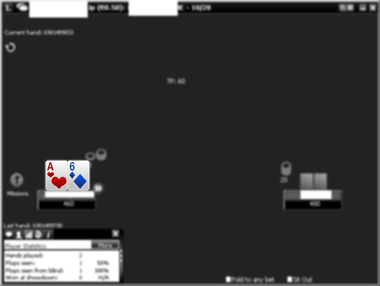
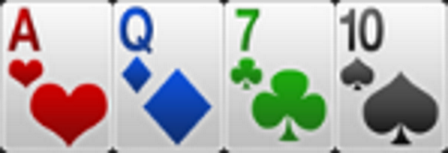

*This is the first part of **Building a Poker Bot** series where I describe my experience developing bot software
for online poker rooms. I'm building the bot with .NET framework and F# language which makes the task relatively
easy and very enjoyable.*

Screen recognition
------------------

For a human, the very first step to the ability to play poker is to understand the cards, what a hand is and
what the value of your hand is. E.g. in Texas Holdem each player gets 2 hole cards which form a hand. At
the showdown the player with the best hand wins.

Poker bots are no different, they also need to be taught the notion of cards and hands. A bot should "watch"
the table and see which cards he is dealt with. There are several ways to achieve that but I go for a technique
called screen recognition, i.e. the bot makes a screenshot of a table and then reads the pixels to understand
what's going on. Very similar to what people do.

Image recognition in general is a tough task. Human beings are very good at interpreting vague images and
recognizing familiar objects. It's much more difficult for computers. General image recognition (think showing
a photo to your computer and asking whether there is an animal there) is very tough; corporations like Google
and Microsoft are spending numerous man-years and employ techniques like machine learning and neural networks.

Fortunately, poker table recognition is much easier. The images to be recognized are machine-generated, so
the same things are rendered more or less the same way all the time. It makes sense to keep the poker table
size fixed to some predefined value which makes recognition task fairly easy.

Card recognition steps
----------------------

There are 13 card faces (from Deuce to Ace) and 4 suits. All of them are just fixed-size images which we need to be able to
match with. So we start with a screenshot of a poker table:


The table size is fixed, so are the left and the top pixel positions of hole cards. So, our first step is to extract
the small images of cards out of the big screenshot:



Now, we can take the recognition of card faces and suits separately. In our sample layout, suits are color coded.
This is very friendly to humans and super simple for the bot. We pick the suit based on the color (ignoring
the white pixels):



This leaves us with the task of choosing between 13 card faces. The color information is not important
here, we can make the image grey-scale. Moreover, we can reduce the color information to the single bit per
pixel - call it white or black:


Now this mask is very simple, and we can compare it with 13 predefined masks for 13 cards pixel by pixel.
The one with the biggest amount of matches wins.

Suit recognition
----------------

Let's put some code at the table. We start with suit recognition. `getSuit` function has type
`Color -> string option` and converts the color of a pixel into the suit name, if possible. Hearts ("h")
are red, Diamonds ("d") are blue, Clubs ("c") are green and Spades ("s") are black:

``` fsharp
let getSuit (c : Color) =
  match c with
  | _ when c.B < 127uy && c.G < 127uy && c.R > 127uy -> Some "h"
  | _ when c.B > 127uy && c.G < 127uy && c.R < 127uy -> Some "d"
  | _ when c.B < 127uy && c.G > 127uy && c.R < 127uy -> Some "c"
  | _ when c.B < 127uy && c.G < 127uy && c.R < 127uy -> Some "s"
  | _ -> None
```

This function is used by `getCardSuit` function of type `(int -> int -> Color) -> int -> int -> string`.
Its first argument is a function which returns the color of a pixel based on `(x, y)`
relative coordinates (starting with 0). The next two arguments are width and height of the cards. Result is
the same suit name that we described above. The function loops through all the pixels, gets a suit per
pixel and then returns the suit which is the most popular among them. Alternatively, we could just return
the first suit found, but my implementation looks more resilient:

``` fsharp
let getCardSuit getPixel width height =
  seq { for x in 0 .. width - 1 do
          for y in 0 .. height - 1 do
            yield getSuit (getPixel x y) }
  |> Seq.choose id
  |> Seq.countBy id
  |> Seq.maxBy (fun (v, c) -> c)
  |> fst
```

Producing the black & white pattern
-----------------------------------

`getCardPattern` accepts the same parameters as `getSuits` but returns `seq<BW>` instead. This is
a sequence of black or white pixels with a helper union type:

``` fsharp
type BW = B | W
```
The function body enumerates the pixels and return black or white result as a flat sequence:

``` fsharp
let getCardPattern getPixel width height =
  let isWhite (c : Color) =
    if c.B > 127uy && c.G > 127uy && c.R > 127uy then W
    else B

  seq { for x in 0 .. width - 1 do
          for y in 0 .. height - 1 do
            yield isWhite (getPixel x y) }
```

Card face recognition
---------------------

Having a black and white pattern, we can compare it with the predefined patterns and pick the
most similar one. A pattern is defined with a helper type

``` fsharp
type CardPattern = {
  Card: string
  Pattern: BW array
}
```

`Pattern` is a sequence which is equivalent to the sequence we got on the previous step.
`Card` is a string of hand face value 2, 3, 4 .. A. `getCardFace` has the type
`CardPattern[] -> seq<BW> -> string`, it accepts an array of known patterns and a pattern
of the card to be recognized. It compares patterns pixel by pixel and returns the card
which has the biggest amount of matches:

``` fsharp
let getCardFace patterns bws =
  let matchCount h p =
    Seq.zip h p
    |> Seq.map (fun (v1, v2) -> if v1 = v2 then 1 else 0)
    |> Seq.sum
    |> decimal
  let maxPattern = patterns |> Array.maxBy (fun p -> matchCount bws p.Pattern)
  maxPattern.Card
```

Getting the known patterns
--------------------------

So how do we create an array of known patterns? It's tedious to do manually, so
we use a bit of code generation.
Basically we just take several screenshots of poker tables and feed them to the following
helper function:

``` fsharp
let parsePattern getPixel width height =
  getCardPattern getPixel width height
  |> Seq.map (fun x -> if x = B then "B" else "W")
  |> String.concat ";"
```

The function creates a string which can be copy-pasted into F# array of `BW`.

Putting it all together
-----------------------

Here is the facade function that will be called from the outside:

``` fsharp
let recognizeCard getPixel width height =
  let value =
    getCardPattern getPixel width height
    |> getCardValue patterns
  let suit = getCardSuit getPixel width height
  value + suit
```

The calling code looks like this:

``` fsharp
let image = new Bitmap("...");

let getPixel offsetX offsetY x y =
  image.GetPixel(offsetX + x, offsetY + y)

let hand = (recognizeCard (getPixel leftX top) width height) + (recognizeCard (getPixel rightX top) width height)
```

`leftX`, `rightX`, `top`, `width` and `height` are well-known parameters of cards locations within a screenshot,
which are hard coded for a given table size.

Conclusion
----------

The full code for card recognition can be found in my [github repo](https://github.com/mikhailshilkov/mikhailio-samples/blob/master/HandRecognition.fs). It's just 75 lines of code which is
much less that one could imagine for a task of image recognition. Similar code could be used to recognize other
fixed objects at poker table: dealer button location, action buttons, checkboxes etc. In the next part of this
series I will show how to recognize non-fixed parts: text and numbers.

*Proceed to [Part 2 of Building a Poker Bot: String and Number Recognition](https://mikhail.io/2016/02/building-a-poker-bot-string-number-recognition/).*