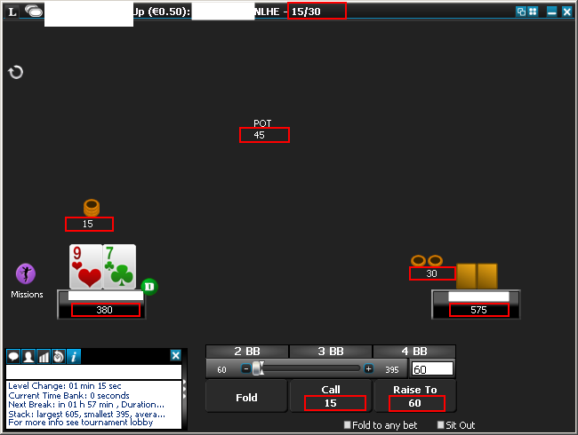
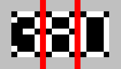

This is the second part of **Building a Poker Bot** series where I describe my experience developing bot software
to play in online poker rooms. I'm building the bot with .NET framework and F# language which makes the task relatively easy and very enjoyable.

Here is the first part: [Building a Poker Bot: Card Recognition](https://mikhail.io/2016/02/building-a-poker-bot-card-recognition/)


Why string recognition
----------------------

Reading cards and other fixed images was the first step. The bot should also
be able to read different text-based information from the screen, e.g.

- Current blind levels
- Current pot size
- The size of bets made by each player
- Player names
- Stack sizes
- Chat messages (for advanced scenarios)

We need this vital information to make proper decisions, so let's look at
how to parse the textual data.

New challenges
--------------

String recognition has some specific difficulties when compared to fixed
images like cards:

- The size of a string is not predefined. Obviously, the longer the string, the
more space it takes on the screen
- The position of a string is not fixed either. Some strings are aligned to
the center, others may diverge based on other variable parts like stakes or blinds
- Different strings might be rendered in different font size

Here is what needs to be done to overcome these complications:

- Pick the layout which makes your life easier
- Adjust fonts and positions if possible
- Make sure that all important strings are always visible and not overlapping to other information
- For each string define a region where it belongs to in 100% cases. The background
of this region should be more or less evenly filled with a color in contrast to the font color.

String recognition steps
------------------------

We start with a screenshot of a poker table again:


We know our fixed regions where our labels are located, so we take those
regions for processing:



For each region we trim away the blank margins around the text (i.e. left,
top, right and bottom padding):


We find dark lines between bright symbols and we consider them as gaps
between characters:



The final step is to compare each symbol to the known patterns and find the best
match (in case of my layout the match for symbols is always 100% perfect). Let's
look how these steps are implemented.

Removing padding around the text
--------------------------------

Because the padding is removed from all 4 sides of the region, I decided to use
`Array2D` data type to be able to iterate in different order. The whole algorithm operates
with black or white points defined as a helper type:

``` fsharp
type BW = B | W
```

So the `removePadding` function has type of `BW[,] -> BW[,]` and looks
like this:

``` fsharp
let removePadding pixels =
  let allBlack s = Seq.exists ((=) W) s
  let maxWidth = Array2D.length1 pixels - 1
  let maxHeight = Array2D.length2 pixels - 1
  let firstX = [0..maxWidth]
    |> Seq.tryFindIndex (fun y -> allBlack pixels.[y, 0..maxHeight])
  let lastX = [0..maxWidth]
    |> Seq.tryFindIndexBack (fun y -> allBlack pixels.[y, 0..maxHeight])
  let firstY = [0..maxHeight]
    |> Seq.tryFindIndex (fun x -> allBlack pixels.[0..maxWidth, x])
  let lastY = [0..maxHeight]
    |> Seq.tryFindIndexBack (fun x -> allBlack pixels.[0..maxWidth, x])

  match (firstX, lastX, firstY, lastY) with
  | (Some fx, Some lx, Some fy, Some ly) -> pixels.[fx..lx, fy..ly]
  | _ -> Array2D.init 0 0 (fun _ _ -> B)
```

The first part finds the amount of fully-black columns and rows in the array.
Then, if white points are found, the second part returns a sub array based on
the indices, otherwise empty array is returned.

Split the text into characters
------------------------------

First, we convert our 2D array into the list of lists, where each item in the
top-level list represents a single column of pixels:

``` fsharp
let pixelColumns =
  [0..Array2D.length1 pixels - 1]
  |> Seq.map (fun x -> pixels.[x, 0..Array2D.length2 pixels - 1] |> List.ofArray)
```

Then we can fold this list of columns into the symbols, where each symbol itself
is the list of columns:

``` fsharp
let splitIntoSymbols (e : BW list) (state: BW list list list) =
  match state with
  | cur::rest ->
      if isSeparator e then
        match cur with
        | _::_ -> []::state // add new list
        | _ -> state        // skip if we already have empty item
      else (e::cur)::rest   // add e to current list
  | _ -> [[e]]

Seq.foldBack splitIntoSymbols pixelColumns []
```

The type of `state` is a bit of brain teaser, I guess it could be improved
by introducing some intermediate type with descriptive name, but I decided
to leave that part for now. Read it as list of symbols, which are lists of
columns, which are lists of pixels.

Match the symbols vs the known patterns
-----------------------------------

This part was already described in [my first article](https://mikhail.io/2016/02/building-a-poker-bot-card-recognition/).
Basically we compare the list of black or white points to the patterns of
the known symbols:

``` fsharp
let getChar patterns bws =
  let samePatterns h p =
    Seq.zip h p
    |> Seq.forall (fun (v1, v2) -> v1 = v2)
  let matchingPattern =
    patterns
      |> Array.filter (fun p -> List.length p.Pattern = List.length bws)
      |> Array.filter (fun p -> samePatterns bws p.Pattern)
      |> Array.tryHead
  defaultArg (Option.map (fun p -> p.Char) matchingPattern) '?'
```

Putting it all together
-----------------------

The `recognizeString` function accepts lower-order functions to match
symbols and get pixels together with width and height of the region:

``` fsharp
recognizeString: (BW list list -> char) -> (int -> int -> color) -> int -> int -> string
```

It builds an array of pixels, removes padding and folds with recognition.

``` fsharp
let recognizeString matchSymbol getPixel width height =

  let pixels =
    Array2D.init width height (fun x y -> isWhite (getPixel x y))
    |> removePadding

  let pixelColumns =
    [0..Array2D.length1 pixels - 1]
    |> Seq.map (fun x -> pixels.[x, 0..Array2D.length2 pixels - 1] |> List.ofArray)

  Seq.foldBack splitIntoSymbols pixelColumns []
  |> List.map matchSymbol
  |> Array.ofSeq
  |> String.Concat
```

Then we use it with a specific recognition patterns, e.g. known digits in case
of numbers recognition:

``` fsharp
let recognizeNumber x =
  recognizeString (getChar numberPatterns) x
```

A way to produce these patterns is discussed in [the previous part](https://mikhail.io/2016/02/building-a-poker-bot-card-recognition/).

Conclusion
----------

String recognition takes a bit more steps to execute comparing to the recognition
of fixed objects. Nevertheless it's pretty straightforward to implement once
we split it into small and well-understood conversion steps. The full code
for card recognition can be found in [my github repo](https://github.com/mikhailshilkov/mikhailio-samples/blob/master/StringRecognition.fs).

*Proceed to [Part 3 of Building a Poker Bot: Mouse Movements](/2016/03/building-a-poker-bot-mouse-movements/).*