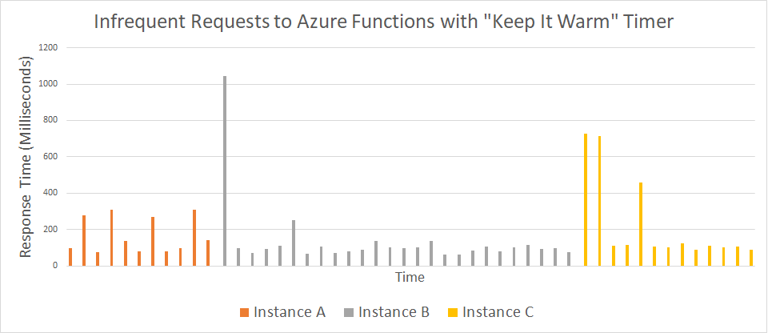
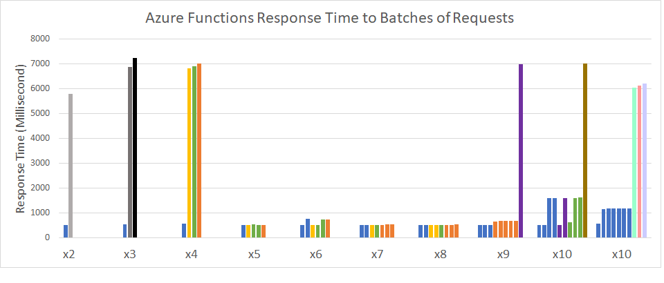

In my [previous article](https://mikhail.io/2018/04/azure-functions-cold-starts-in-numbers/)
I've explored the topic of Cold Starts in Azure Functions. Particularly, I've measured the
cold start delays per language and runtime version.

I received some follow-up questions that I'd like to explore in today's post:

- Can we avoid cold starts except the very first one by keeping the instance warm?
- Given one warm instance, if two requests come at the same time, will one request hit
a cold start because existing instance is busy with the other?
- In general, does a cold start happen at scale-out when a new extra instance is provisioned?

Again, we are only talking Consumption Plan here.

Theory
------

Azure Functions are running on instances provided by Azure App Service. Each instance is
able to process several requests concurrently, which is different comparing to AWS Lambda.

Thus, the following *could* be true:

- If we issue at least 1 request every 20 minutes, the first instance should stay warm for
long time
- Simultaneous requests don't cause cold start unless the existing instance gets too busy
- When runtime decides to scale out and spin up a new instance, it could do so in the background,
still forwarding incoming requests to the existing warm instance(s). Once the new instance
is ready, it could be added to the pool without causing cold starts
- If so, cold starts are mitigated beyond the very first execution

Let's put this theory under test!

Keeping Always Warm
-------------------

I've tested a Function App which consists of two Functions:

- HTTP Function under test
- Timer Function which runs every 10 minutes and does nothing but logging 1 line of text

I then measured the cold start statistics similar to all the tests from my previous article.

During 2 days I was issuing infrequent requests to the same app, most of them would normally
lead to a cold start. Interestingly, even though I was regularly firing the timer, Azure
switched instances to serve my application 2 times during the test period:



I can see that most responses are fast, so timer "warmer" definitely helps.

The first request(s) to a new instance are slower than subsequent ones. Still, they are faster
than normal full cold start time, so it could be related to HTTP stack loading.

Anyway, keeping Functions warm seems a viable strategy.

Parallel Requests
-----------------

What happens when there is a warm instance, but it's already busy with processing another
request? Will the parallel request be delayed, or will it be processed by the same
warm instance?

I tested with a very lightweight function, which nevertheless takes some time to complete:

``` csharp
public static async Task<HttpResponseMessage> Delay500([HttpTrigger] HttpRequestMessage req)
{
    await Task.Delay(500);
    return req.CreateResponse(HttpStatusCode.OK, "Done");
}
```

I believe it's an OK approximation for an IO-bound function.

The test client then issued 2 to 10 parallel requests to this function and measured the
response time for all requests.

It's not the easiest chart to understand in full, but note the following:

- Each group of bars are for requests sent at the same time. Then there goes a pause about
20 seconds before the next group of requests gets sent

- The bars are colored by the instance which processed that request: same instance - same
color



Here are some observations from this experiment:

- Out of 64 requests, there were 11 cold starts

- Same instance *can* process multiple simultaneous requests, e.g. one instance processed
7 out of 10 requests in the last batch

- Nonetheless, Azure is eager to spin up new instances for multiple requests. In total
12 instances were created, which is even more than max amount of requests in any single
batch

- Some of those instances were actually never reused (gray-ish bars in batched x2 and x3,
brown bar in x10)

- The first request to each new instance pays the full cold start price. Runtime doesn't
provision them in background while reusing existing instances for received requests

- If an instance handled more than one request at a time, response time invariably suffers,
even though the function is super lightweight (`Task.Delay`)

Conclusion
----------

Getting back to the experiment goals, there are several things that we learned.

For low-traffic apps with sporadic requests it makes sense to setup a "warmer" timer
function firing every 10 minutes or so to prevent the only instance from being recycled.

However, scale-out cold starts are real and I don't see any way to prevent them from
happening.

When multiple requests come in at the same time, we might expect some of them to hit
a new instance and get slowed down. The exact algorithm of instance reuse is not
entirely clear.

Same instance is capable of processing multiple requests in parallel, so there are
possibilities for optimization in terms of routing to warm instances during the
provisioning of cold ones.

If such optimizations happen, I'll be glad to re-run my tests and report any noticeable
improvements.

Stay tuned for more serverless perf goodness!