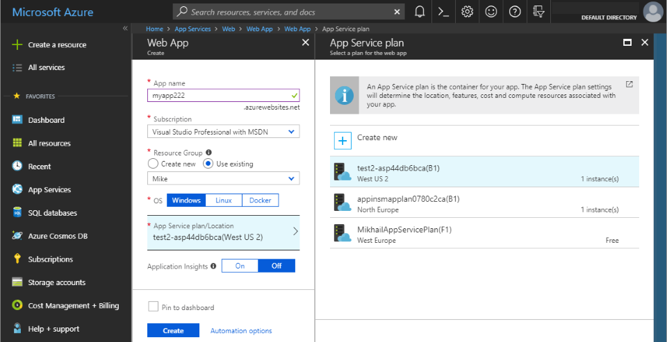
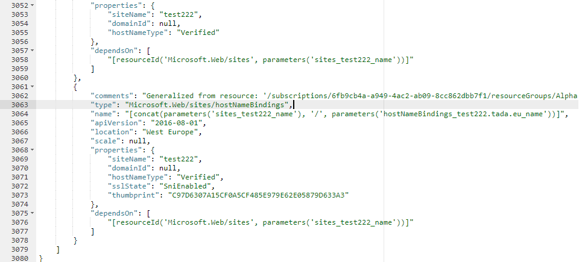
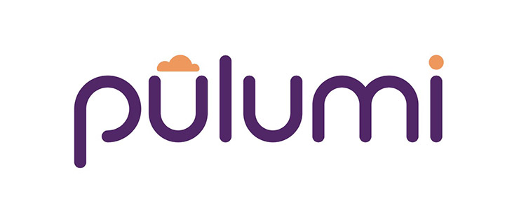

Modern Cloud providers offer a wide variety of services of different types
and levels. A modern cloud application would leverage multiple services
in order to be efficient in terms of developer experience, price, operations
etc.

For instance, a very simple Web Application deployed to Azure PaaS services
could use

- App Service - to host the application
- App Service Plan - to define the instance size, price, scaling and other
hosting parameters
- Azure SQL Database - to store relational data
- Application Insights - to collect telemetry and logs
- Storage Account - to store the binaries and leverage Run-as-Zip feature

Provisioning such environment becomes a task on its own:

- How do we create the initial setup?
- How do we make changes?
- What if we need multiple environments?
- How do we apply settings?
- How do we recycle resources which aren't needed anymore?

Well, there are several options.

Manually in Azure Portal
------------------------

We all start doing this in Azure Portal. User Interface is great for
discovering new services and features, and it's a quick way to make a single
change.



*Creating an App Service in Azure Portal*

Clicking buttons manually doesn't scale though. After the initial setup is
complete, maintaining the environment over time poses significant challenges:

- Every change requires going back to the portal, finding the right resource
and doing the right change
- People make mistakes, so if you have multiple environments, they are likely
to be different in subtle ways
- Naming gets messy over time
- There is no easily accessible history of environment changes
- Cleaning up is hard: usually some leftovers will remain unnoticed
- Skills are required from everybody involved in provisioning

So, how do we streamline this process?

Azure PowerShell, CLI and Management SDKs
-----------------------------------------

Azure comes with a powerful set of tools to manage resources with code.

You can use PowerShell, CLI scripts or custom code like C# to do with code
whatever is possible to do via portal.

``` csharp
var webApp = azure.WebApps.Define(appName)
    .WithRegion(Region.WestEurope)
    .WithNewResourceGroup(rgName)
    .WithNewFreeAppServicePlan()
    .Create();
```

*Fluent C# code creating an App Service*

However, those commands are usually expressed in imperative style of 
CRUD operations. You can run the commands once, but it's hard to modify
existing resources from an arbitrary state to the desired end state.

Azure Resource Manager Templates
--------------------------------

All services in Azure are managed by Azure Resource Manager (ARM). ARM 
has a special JSON-based format for templates. 

Once a template is defined,
it's relatively straightforward to be deployed to Azure environment. So, if
resources are defined in JSON, they will be created automatically via
PowerShell or CLI commands.

It is also possible to deploy templates in incremental mode, when the tool
will compare existing environment with desired configuration and will deploy
the difference.

Templates can be parametrized, which enables multi-environment deployments.

There's a problem with templates though: they are JSON files. They get
very large very fast, they are hard to reuse, it's easy to make a typo.



*A fragment of auto-generated ARM Template for App Service, note the 
line numbers*

Terraform is another templating tool to provision cloud resources but it uses
YAML instead of JSON. I don't have much experience with it, but the problems 
seem to be very similar.

Can we combine the power of SDKs and the power of JSON-/YAML-based desired state
configuration tools?

Pulumi
------

One potential solution has just arrived.
A startup called Pulumi [just went out of private beta to open source](http://joeduffyblog.com/2018/06/18/hello-pulumi/).



Pulumi wants to be much more than a better version of ARM templates, aiming
to become the tool to build cloud-first distributed systems. But for today I'll 
focus on lower level of resource provisioning task.

With Pulumi cloud infrastructure is defined in code using full-blown general 
purpose programming languages.

The workflow goes like this:

- Define a Stack, which is a container for a group of related resources
- Write a program in one of supported languages (I'll use TypeScript) which
references `pulumi` libraries and constructs all the resources as objects
- Establish connection with your Azure account
- Call `pulumi` CLI to create, update or destroy Azure resources based on
the program
- Pulumi will first show the preview of changes, and then apply them as
requested

Pulumi Program
--------------

I'm using TypeScript to define my Azure resources in Pulumi. So, the program
is a normal Node.js application with `index.ts` file, package references in 
`package.json` and one extra file `Pulumi.yaml` to define the program:

``` yaml
name: azure-appservice
runtime: nodejs
```

Our `index.js` is as simple as a bunch of `import` statements followed by
creating TypeScript objects per desired resource. The simplest program can
look like this:

``` ts
import * as pulumi from "@pulumi/pulumi";
import * as azure from "@pulumi/azure";

const resourceGroup = new azure.core.ResourceGroup("myrg", {
    location: "West Europe"
});
```

When executed by `pulumi update` command, this program will create a new
Resource Group in your Azure subscription.

Chaining Resources
------------------

When multiple resources are created, the properties of one resource will
depend on properties of the others. E.g. I've defined the Resource Group
above, and now I want to create an App Service Plan under this Group:

``` ts
const resourceGroupArgs = {
    resourceGroupName: resourceGroup.name,
    location: resourceGroup.location
};

const appServicePlan = new azure.appservice.Plan("myplan", {
    ...resourceGroupArgs,

    kind: "App",

    sku: {
        tier: "Basic",
        size: "B1",
    },
});
```

I've assigned `resourceGroupName` and `location` of App Service Plan to
values from the Resource Group. It looks like a simple assignment of
strings but in fact it's more complicated.

Property `resourceGroup.name` has the type of `pulumi.Output<string>`.
Constructor argument `resourceGroupName` of `Plan` has the type of
`pulumi.Input<string>`.

We assigned `"myrg"` value to Resource Group name, but during the actual 
deployment it will change. Pulumi will append a unique identifier to the name,
so the actually provisioned group will be named e.g. `"myrg65fb103e"`.

This value will materialize inside `Output` type only at deployment time, 
and then it will get propagated to `Input` by Pulumi.

There is also a nice way to return the end values of `Output`'s from Pulumi
program. Let's say we define an App Service:

``` ts
const app = new azure.appservice.AppService("mywebsite", {
    ...resourceGroupArgs,

    appServicePlanId: appServicePlan.id
});
```

First, notice how we used TypeScript spread operator to reuse
properties from `resourceGroupArgs`.

Second, `Output`-`Input` assignment got used again to propagate App Service
Plan ID.

Lastly, we can now export App Service host name from our program, e.g.
for the user to be able to go to the web site immediately after deployment:

``` ts
exports.hostname = app.defaultSiteHostname;
```

`Output` can also be transformed with `apply` function. Here is the code to
format output URL:

``` ts
exports.endpoint = app.defaultSiteHostname.apply(n => `https://${n}`);
```

Running `pulumi update` from CLI will then print the endpoint for us:

``` sh
---outputs:---
endpoint: "https://mywebsiteb76260b5.azurewebsites.net"
```

Multiple outputs can be combined with `pulumi.all`, e.g. given SQL Server
and Database, we could make a connection string:

``` ts
const connectionString = 
    pulumi.all([sqlServer, database]).apply(([server, db]) => 
        `Server=tcp:${server}.database.windows.net;initial catalog=${db};user ID=${username};password=${pwd};Min Pool Size=0;Max Pool Size=30;Persist Security Info=true;`)
```

Using the Power of NPM
----------------------

Since our program is just a TypeScript application, we are free to use any
3rd party package which exists out there in NPM.

For instance, we can install Azure Storage SDK. Just

``` sh
npm install azure-storage@2.9.0-preview
```

and then we can write a function to produce SAS token for a Blob in Azure
Storage:

``` ts
import * as azurestorage from "azure-storage";

// Given an Azure blob, create a SAS URL that can read it.
export function signedBlobReadUrl(
    blob: azure.storage.Blob | azure.storage.ZipBlob,
    account: azure.storage.Account,
    container: azure.storage.Container,
): pulumi.Output<string> {
    const signatureExpiration = new Date(2100, 1);

    return pulumi.all([
        account.primaryConnectionString,
        container.name,
        blob.name,
    ]).apply(([connectionString, containerName, blobName]) => {
        let blobService = new azurestorage.BlobService(connectionString);
        let signature = blobService.generateSharedAccessSignature(
            containerName,
            blobName,
            {
                AccessPolicy: {
                    Expiry: signatureExpiration,
                    Permissions: azurestorage.BlobUtilities.SharedAccessPermissions.READ,
                },
            }
        );

        return blobService.getUrl(containerName, blobName, signature);
    });
}
```

I took this function from [Azure Functions](https://github.com/pulumi/examples/tree/master/azure-ts-functions)
example, and it will probably move to Pulumi libraries at some point, but until
then you are free to leverage the package ecosystem.

Deploying Application Files
---------------------------

So far we provisioned Azure App Service, but we can also deploy the application
files as part of the same workflow.

The code below is using [Run from Zip](https://github.com/Azure/app-service-announcements/issues/84)
feature of App Service:

1. Define Storage Account and Container

    ``` ts
    const storageAccount = new azure.storage.Account("mystorage", {
        ...resourceGroupArgs,

        accountKind: "StorageV2",
        accountTier: "Standard",
        accountReplicationType: "LRS",
    });

    const storageContainer = new azure.storage.Container("mycontainer", {
        resourceGroupName: resourceGroup.name,
        storageAccountName: storageAccount.name,
        containerAccessType: "private",
    });
    ```

2. Create a folder with application files, e.g. `wwwroot`. It may contain
some test HTML, ASP.NET application, or anything supported by App Service.

3. Produce a zip file from that folder in Pulumi program:

    ``` ts
    const blob = new azure.storage.ZipBlob("myzip", {
        resourceGroupName: resourceGroup.name,
        storageAccountName: storageAccount.name,
        storageContainerName: storageContainer.name,
        type: "block",

        content: new pulumi.asset.FileArchive("wwwroot")
    });
    ```

4. Produce SAS Blob URL and assign it to App Service Run-as-Zip setting:

    ``` ts
    const codeBlobUrl = signedBlobReadUrl(blob, storageAccount, storageContainer);

    const app = new azure.appservice.AppService("mywebsite", {
        ...resourceGroupArgs,

        appServicePlanId: appServicePlan.id,

        appSettings: {
            "WEBSITE_RUN_FROM_ZIP": codeBlobUrl
        }
    });
    ```

Run the program, and your Application will start as soon as `pulumi update`
is complete.

Determinism
-----------

Pulumi programs should strive to be deterministic.
That means you should avoid using things like current date/time or random numbers.

The reason is incremental updates. Every time you run `pulumi update`, it
will execute the program from scratch. If your resources depend on random
values, they will not match the existing resources and thus the false
delta will be detected and deployed.

In the SAS generation example above we used a fixed date in the future
instead of doing today + 1 year kind of calculation.

Should Pulumi provide some workaround for this?

Conclusion
----------

My code was kindly merged to 
[Pulumi examples](https://github.com/pulumi/examples/tree/master/azure-ts-appservice), 
go there for the complete runnable program that provisions App Service with
Azure SQL Database and Application Insights.

I really see high potential in Cloud-as-Code approach suggested by Pulumi.
Today we just scratched the surface of the possibilities. We were working
with cloud services on raw level: provisioning specific services with
given parameters.

Pulumi's vision includes providing higher-level components to blur the line
between infrastructure and code, and to enable everybody to create such
components on their own.

Exciting future ahead!