Stateful Workflows on top of Stateless Serverless Cloud Functions&mdash;this is the essence
of the Azure Durable Functions library. That's a lot of fancy words in one sentence, and they
might be hard for the majority of readers to understand.

Please join me on the journey where I'll try to explain how those buzzwords fit
together. I will do this in 3 steps:

- Describe the context of modern cloud applications relying on serverless architecture;
- Identify the limitations of basic approaches to composing applications out of the simple building blocks;
- Explain the solutions that Durable Functions offer for those problems.

Microservices
-------------

Traditionally, server-side applications were built in a style which is now referred to as
**Monolith**. If multiple people and teams were developing parts of the same application, they
mostly contributed to the same code base. If the code base were structured well, it would have
some distinct modules or components, and a single team would typically own each module:

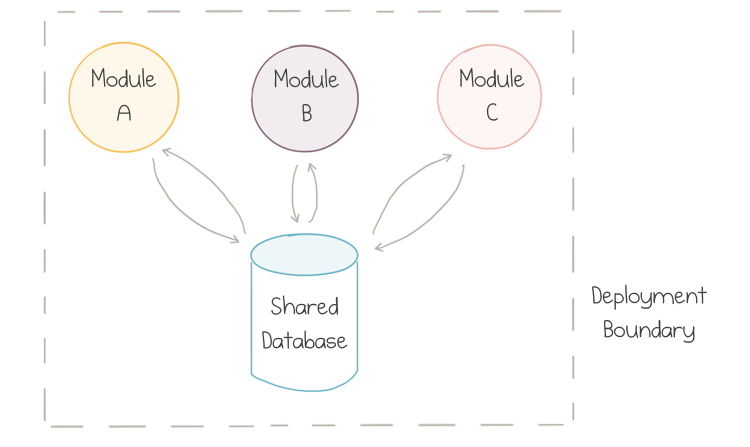

<center class="img-caption">Multiple components of a monolithic application</center>

Usually, the modules would be packaged together at build time and then deployed as a single
unit, so a lot of communication between modules would stay inside the OS process.

Although the modules could stay loosely coupled over time, the coupling almost always occurred
on the level of the data store because all teams would use a single centralized database.

This model works great for small- to medium-size applications, but it turns out that teams
start getting in each other's way as the application grows since synchronization of contributions
takes more and more effort.

As a complex but viable alternative, the industry came up with a revised service-oriented
approach commonly called **Microservices**. The teams split the big application into "vertical slices" 
structured around the distinct business capabilities:

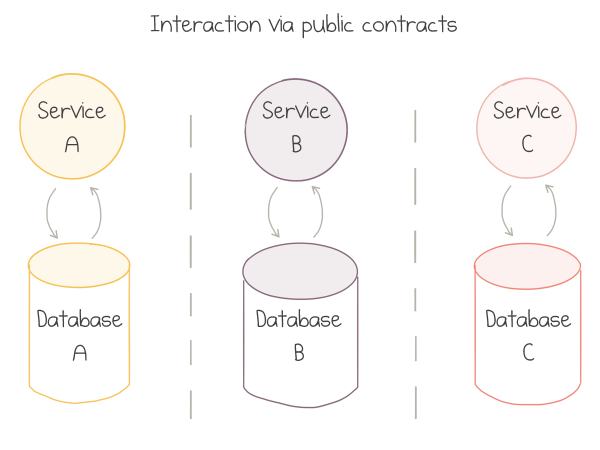

<center class="img-caption">Multiple components of a microservice-based application</center>

Each team then owns a whole vertical&mdash;from public communication contracts, or even UIs, down
to the data storage. Explicitly shared databases are strongly discouraged. Services talk to each
other via documented and versioned public contracts.

If the borders for the split were selected well&mdash;and that's the most tricky part&mdash;the
contracts stay stable over time, and thin enough to avoid too much chattiness. This gives
each team enough autonomy to innovate at their best pace and to make independent technical decisions.

One of the drawbacks of microservices is the change in deployment model. The services are now
deployed to separate servers connected via a network:

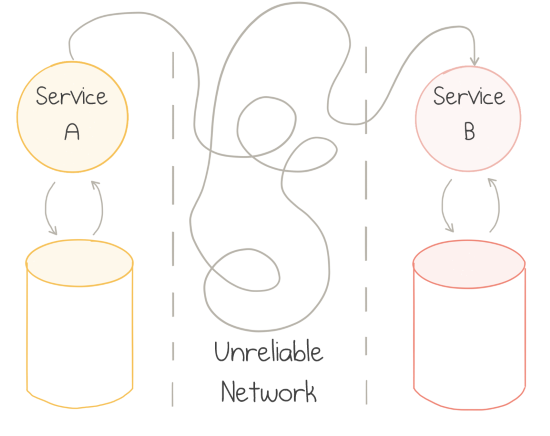

<center class="img-caption">Challenges of communication between distributed components</center>

Networks are fundamentally unreliable: they work just fine most of the time, but when they 
fail, they fail in all kinds of unpredictable and least desirable manners. There are books
written on the topic of distributed systems architecture. TL;DR: it's hard.

A lot of the new adopters of microservices tend to ignore such complications. REST over HTTP(S) is the
dominant style of connecting microservices. Like any other synchronous communication
protocol, it makes the system brittle.

Consider what happens when one service becomes temporary unhealthy: maybe its database goes offline, or it's struggling to 
keep up with the request load, or a new version of the service is being deployed. All the requests to the problematic service start
failing&mdash;or worse&mdash;become very slow. The dependent service waits for the response, and
thus blocks all incoming requests of its own. The error propagates upstream very quickly causing cascading
failures all over the place:

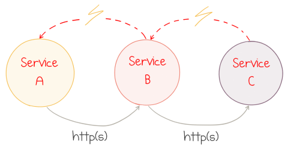

<center class="img-caption">Error in one component causes cascading failures</center>

The application is down. Everybody screams and starts the blame war.

Event-Driven Applications
-------------------------

While cascading failures of HTTP communication can be mitigated with patterns like a circuit breaker
and graceful degradation, a better solution is to switch to the asynchronous style of communication
as the default. Some kind of persistent queueing service is used as an intermediary.

The style of application architecture which is based on sending events between services
is known as **Event-Driven**. When a service does something useful, it publishes an event&mdash;a record 
about the fact which happened to its business domain. Another service listens to the published events and 
executes its own duty in response to those facts:


<center class="img-caption">Communication in event-driven applications</center>

The service that produces events might not know about the consumers. New event subscribers can
be introduced over time. This works better in theory than in practice, but the services tend to
get coupled less.

More importantly, if one service is down, other services don't catch fire immediately. The
upstream services keep publishing the events, which build up in the queue but can be stored safely
for hours or days. The downstream services might not be doing anything useful for this particular
flow, but it can stay healthy otherwise.

However, another potential issue comes hand-in-hand with loose coupling: low cohesion.
As Martin Fowler notices in his essay
[What do you mean by "Event-Driven"](https://martinfowler.com/articles/201701-event-driven.html):

> It's very easy to make nicely decoupled systems with event notification, without realizing 
> that you're losing sight of the larger-scale flow.

Given many components that publish and subscribe to a large number of event types, it's easy to stop
seeing the forest for the trees. Combinations of events usually constitute gradual workflows executed 
in time. A workflow is more than the sum of its parts, and understanding of the high-level flow is 
paramount to controlling the system behavior.

Hold this thought for a minute; we'll get back to it later. Now it's time to talk *cloud*.

Cloud
-----

The birth of public cloud changed the way we architect applications. It made many things
much more straightforward: provisioning of new resources in minutes instead of months, scaling elastically
based on demand, and resiliency and disaster recovery at the global scale.

It made other things more complicated. Here is the picture of the global Azure network:

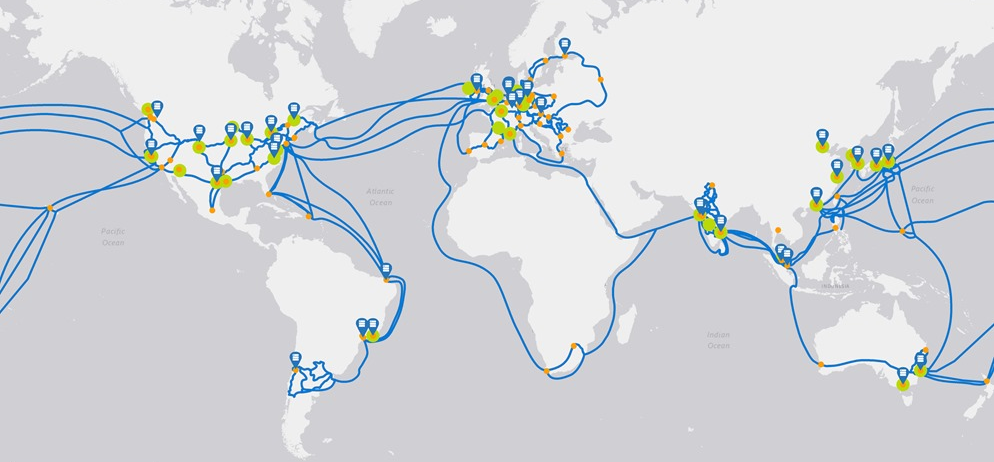

<center class="img-caption">Azure locations with network connections</center>

There are good reasons to deploy applications to more than one geographical location:
among others, to reduce network latency by staying close to the customer, and to achieve resilience through 
geographical redundancy. Public Cloud is the ultimate distributed system. As you remember,
distributed systems are hard.

There's more to that. Each cloud provider has dozens and dozens of managed services, which is
the curse and the blessing. Specialized services are great to provide off-the-shelf solutions 
to common complex problems. On the flip side, each service has distinct properties regarding 
consistency, resiliency and fault tolerance.

In my opinion, at this point developers have to embrace the public cloud and apply the distributed 
system design on top of it. If you agree, there is an excellent way to approach it.

Serverless
----------

The slightly provocative term **serverless** is used to describe cloud services that do not
require provisioning of VMs, instances, workers, or any other fixed capacity to run
custom applications on top of them. Resources are allocated dynamically and transparently,
and the cost is based on their actual consumption, rather than on pre-purchased capacity.

Serverless is more about operational and economical properties of the system than about the
technology per se. Servers do exist, but they are someone else's concern. You don't manage
the uptime of serverless applications: the cloud provider does.

On top of that, you pay for what you use, similar to the consumption of other commodity resources
like electricity. Instead of buying a generator to power up your house, you just purchase energy
from the power company. You lose some control (e.g., no way to select the voltage), but this is fine
in most cases. The great benefit is no need to buy and maintain the hardware.

Serverless compute does the same: it supplies standard services on a pay-per-use basis.

If we talk more specifically about Function-as-a-Service offerings like Azure Functions, they
provide a standard model to run small pieces of code in the cloud.
You zip up the code or binaries and send it to Azure; Microsoft takes care of all the
hardware and software required to run it. The infrastructure automatically scales up or down based
on demand, and you pay per request, CPU time and memory that the application consumed. 
No usage&mdash;no bill.

However, there's always a "but". FaaS services come with an opinionated development model that
applications have to follow:

- **Event-Driven**: for each serverless function you have to define a specific trigger&mdash;the 
event type which causes it to run, be it an HTTP endpoint or a queue message;

- **Short-Lived**: functions can only run up to several minutes, and preferably for a few seconds 
or less;

- **Stateless**: as you don't control where and when function instances are provisioned or
deprovisioned, there is no way to store data within the process between requests reliably;
external storage has to be utilized.

Frankly speaking, the majority of existing applications don't really fit into this model.
If you are lucky to work on a new application (or a new module of it), you are in better shape.

A lot of the serverless applications may be designed to look somewhat similar to this example
from [the Serverless360 blog](https://www.serverless360.com/blog/building-reactive-solution-with-azure-event-grid):

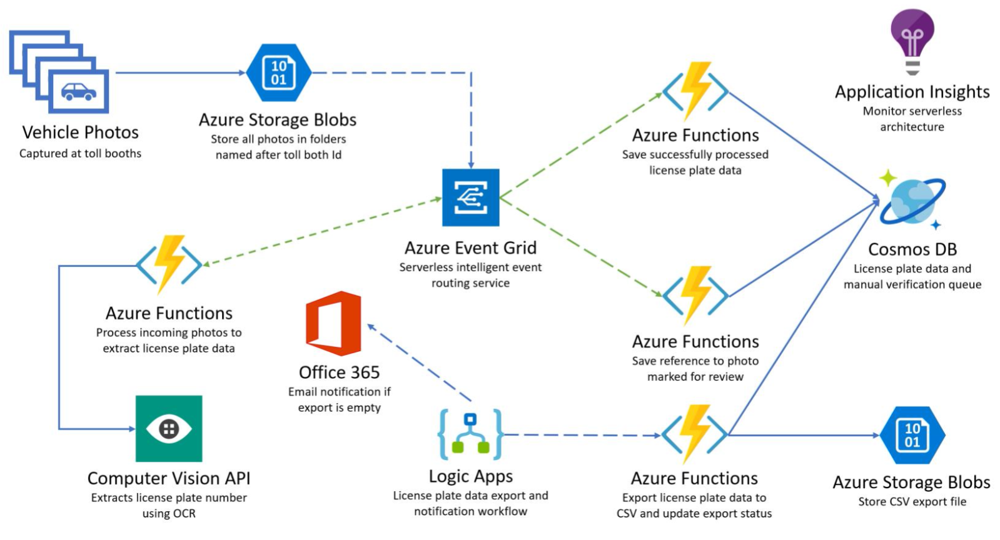

<center class="img-caption">Sample application utilizing "serviceful" serverless architecture</center>

There are 9 managed Azure services working together in this app. Most of them have a unique purpose, but
the services are all glued together with Azure Functions. An image is uploaded to Blob Storage, an
Azure Function calls Vision API to recognize the license plate and send the result to Event Grid, another 
Azure Function puts that event to Cosmos DB, and so on.

This style of cloud applications is sometimes referred to as **Serviceful** to emphasize the heavy usage
of managed services "glued" together by serverless functions.

Creating a comparable application without any managed services would be a much harder task,
even more so, if the application has to run at scale. Moreover, there's no way to keep the pay-as-you-go 
pricing model in the self-service world.

The application pictured above is still pretty straightforward. The processes
in enterprise applications are often much more sophisticated.

Remember the quote from Martin Fowler about losing sight of the large-scale flow. That was
true for microservices, but it's even more true for the "nanoservices" of cloud functions.

I want to dive deeper and give you several examples of related problems.

Challenges of Serverless Composition
------------------------------------

For the rest of the article, I'll define an imaginary business application for booking trips to software
conferences. In order to go to a conference, I need to buy tickets to the conference itself,
purchase the flights, and book a room at a hotel.

In this scenario, it makes sense to create three Azure Functions, each one responsible for one step
of the booking process. As we prefer message passing, each Function emits an event which
the next function can listen for:


<center class="img-caption">Conference booking application</center>

This approach works, however, problems do exist.

### Flexible Sequencing

As we need to execute the whole booking process in sequence, the Azure Functions are wired
one after another by configuring the output of one function to match with the event source of
the downstream function.

In the picture above, the functions' sequence is hard-defined. If we were to swap the order of booking 
the flights and reserving the hotel, that would require a code change&mdash;at least of the 
input/output wiring definitions, but probably also the functions' parameter types.

In this case, are the functions *really* decoupled?

### Error Handling

What happens if the Book Flight function becomes unhealthy, perhaps due to the
outage of the third-party flight-booking service? Well, that's why we use asynchronous messaging:
after the function execution fails, the message returns to the queue and is picked
up again by another execution.

However, such retries happen almost immediately for most event sources. This might not
be what we want: an exponential back-off policy could be a smarter idea. At this point,
the retry logic becomes **stateful**: the next attempt should "know" the history of previous attempts
to make a decision about retry timing.

There are more advanced error-handling patterns too. If executions failures are not
intermittent, we may decide to cancel the whole process and run compensating actions
against the already completed steps.

An example of this is a fallback action: if the flight is not possible (e.g., no routes for this
origin-destination combination), the flow could choose to book a train instead:

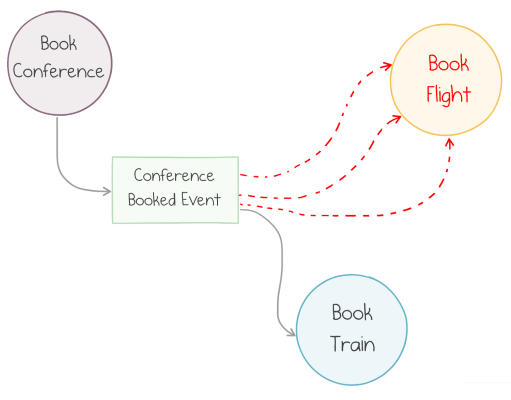

<center class="img-caption">Fallback after 3 consecutive failures</center>

This scenario is not trivial to implement with stateless functions. We could wait until a
message goes to the dead-letter queue and then route it from there, but this is brittle and
not expressive enough.

### Parallel Actions

Sometimes the business process doesn't have to be sequential. In our reservation scenario,
there might be no difference whether we book a flight before a hotel or vice versa. It could
be desirable to run those actions in parallel.

Parallel execution of actions is easy with the pub-sub capabilities of an event bus: both functions
should subscribe to the same event and act on it independently.

The problem comes when we need to reconcile the outcomes of parallel actions, e.g., calculate the
final price for expense reporting purposes:


<center class="img-caption">Fan-out / fan-in pattern</center>

There is no way to implement the Report Expenses block as a single Azure Function: functions
can't be triggered by two events, let alone correlate two *related* events.

The solution would probably include two functions, one per event, and the shared storage
between them to pass information about the first completed booking to the one who
completes last. All this wiring has to be implemented in custom code. The complexity grows
if more than two functions need to run in parallel.

Also, don't forget the edge cases. What if one of the function fails? How do you make sure there is
no race condition when writing and reading to/from the shared storage?

### Missing Orchestrator

All these examples give us a hint that we need an additional tool to organize low-level
single-purpose independent functions into high-level workflows.

Such a tool can be called an **Orchestrator** because its sole mission is to delegate work
to stateless actions while maintaining the big picture and history of the flow.

Azure Durable Functions aims to provide such a tool.

Introducing Azure Durable Functions
-----------------------------------

### Azure Functions

Azure Functions is the serverless compute service from Microsoft. Functions are event-driven:
each function defines a **trigger**&mdash;the exact definition of the event source, for instance,
the name of a storage queue.

Azure Functions can be programmed in [several languages](https://docs.microsoft.com/en-us/azure/azure-functions/supported-languages). 
A basic Function with a
[Storage Queue trigger](https://docs.microsoft.com/azure/azure-functions/functions-bindings-storage-queue)
implemented in C# would look like this: 

``` csharp
[FunctionName("MyFirstFunction")]
public static void QueueTrigger(
    [QueueTrigger("myqueue-items")] string myQueueItem, 
    ILogger log)
{
    log.LogInformation($"C# function processed: {myQueueItem}");
}
```

The `FunctionName` attribute exposes the C# static method as an Azure Function named `MyFirstFunction`. 
The `QueueTrigger` attribute defines the name of the storage queue to listen to. The function body
logs the information about the incoming message.

### Durable Functions

[Durable Functions](https://docs.microsoft.com/azure/azure-functions/durable/durable-functions-overview)
is a library that brings workflow orchestration abstractions to
Azure Functions. It introduces a number of idioms and tools to define stateful,
potentially long-running operations, and manages a lot of mechanics of reliable communication 
and state management behind the scenes.

The library records the history of all actions in Azure Storage services, enabling durability 
and resilience to failures.

Durable Functions is 
[open source](https://github.com/Azure/azure-functions-durable-extension), 
Microsoft accepts external contributions, and the community is quite active.

Currently, you can write Durable Functions in 3 programming languages: C#, F#, and
Javascript (Node.js). All my examples are going to be in C#. For Javascript,
check [this quickstart](https://docs.microsoft.com/en-us/azure/azure-functions/durable/quickstart-js-vscode)
and [these samples](https://github.com/Azure/azure-functions-durable-extension/tree/master/samples/javascript).
For F# see [the samples](https://github.com/Azure/azure-functions-durable-extension/tree/master/samples/fsharp),
[the F#-specific library](https://github.com/mikhailshilkov/DurableFunctions.FSharp) and my article 
[A Fairy Tale of F# and Durable Functions](https://mikhail.io/2018/12/fairy-tale-of-fsharp-and-durable-functions/). 

Workflow building functionality is achieved by the introduction of two additional types
of triggers: Activity Functions and Orchestrator Functions.

### Activity Functions

Activity Functions are simple stateless single-purpose building blocks
that do just one task and have no awareness of the bigger workflow. 
A new trigger type,
`ActivityTrigger`, was introduced to expose functions as workflow steps, as
I explain below.

Here is a simple Activity Function implemented in C#:

``` csharp
[FunctionName("BookConference")]
public static ConfTicket BookConference([ActivityTrigger] string conference)
{
    var ticket = BookingService.Book(conference);
    return new ConfTicket { Code = ticket };
}
```

It has a common `FunctionName` attribute to expose the C# static method as an
Azure Function named `BookConference`. The name is important because it is used to
invoke the activity from orchestrators.

The `ActivityTrigger` attribute defines the trigger type and points to the input
parameter `conference` which the activity expects to get for each invocation.

The function can return a result of any serializable type; my sample function
returns a simple property bag called `ConfTicket`.

Activity Functions can do pretty much anything: call other services, load and
save data from/to databases, and use any .NET libraries.

### Orchestrator Functions

The Orchestrator Function is a unique concept introduced by Durable Functions. Its sole
purpose is to manage the flow of execution and data among several activity functions.

Its most basic form chains multiple independent activities into a single
sequential workflow.

Let's start with an example which books a conference ticket, a flight itinerary, and
a hotel room one-by-one:

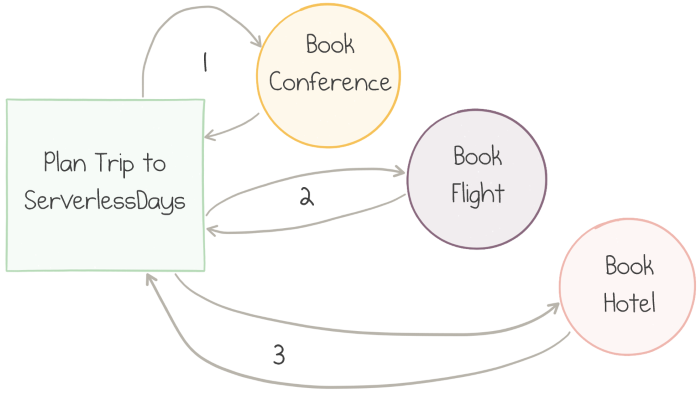

<center class="img-caption">3 steps of a workflow executed in sequence</center>

The implementation of this workflow is defined by another C# Azure Function, this time with
`OrchestrationTrigger`:

``` csharp
[FunctionName("SequentialWorkflow")]
public static async Task Sequential([OrchestrationTrigger] DurableOrchestrationContext context)
{
    var conference = await context.CallActivityAsync<ConfTicket>("BookConference", "ServerlessDays");
    var flight = await context.CallActivityAsync<FlightTickets>("BookFlight", conference.Dates);
    await context.CallActivityAsync("BookHotel", flight.Dates);
}
```

Again, attributes are used to describe the function for the Azure runtime.

The only input parameter has type `DurableOrchestrationContext`. This context is the tool that
enables the orchestration operations.

In particular, the `CallActivityAsync` method is used three times to invoke three activities one after the other.
The method body looks very typical for any C# code working with a `Task`-based API. However,
the behavior is entirely different. Let's have a look at the implementation details.

Behind the Scenes
-----------------

Let's walk through the lifecycle of one execution of the sequential workflow above.

When the orchestrator starts running, the first `CallActivityAsync` invocation is made to book the
conference ticket. What actually happens here is that a queue message is sent from the orchestrator
to the activity function. 

The corresponding activity function gets triggered by the queue message. It does its job (books the 
ticket) and returns the result. The activity function serializes the result and sends it as a queue 
message back to the orchestrator:

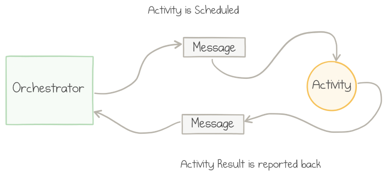

<center class="img-caption">Messaging between the orchestrator and the activity</center>

When the message arrives, the orchestrator gets triggered again and can proceed to the second
activity. The cycle repeats&mdash;a message gets sent to Book Flight activity, it gets triggered, does its
job, and sends a message back to the orchestrator.
The same message flow happens for the third call.

### Stop-resume behavior

As discussed earlier, message passing is intended to decouple the sender and receiver in time.
For every message in the scenario above, no immediate response is expected. 

On the C# level, when the `await` operator is executed, the code doesn't block the execution of the whole
orchestrator. Instead, it just quits: the orchestrator stops being active and its current step completes.

Whenever a return message arrives from an activity, the orchestrator code restarts. It always starts
with the first line. Yes, this means that the same line is executed multiple times: up to the number of
messages to the orchestrator.

However, the orchestrator stores the history of its past executions in Azure Storage, so the effect of the second pass
of the first line is different: instead of sending a message to the activity it already knows
the result of that activity, so `await` returns this result back and assigns it to the `conference` variable.

Because of these "replays", the orchestrator's implementation has to be deterministic: don't use
`DateTime.Now`, random numbers or multi-thread operations; more details
[here](https://docs.microsoft.com/en-us/azure/azure-functions/durable/durable-functions-checkpointing-and-replay#orchestrator-code-constraints).

### Event Sourcing

Azure Functions are stateless, while workflows require a state to keep track of their progress. Every time a new
action towards the workflow's execution happens, the framework automatically records an event in table storage.

Whenever an orchestrator restarts the execution because a new message arrives from its activity,
it loads the complete history of this particular execution from storage. Durable Context uses
this history to make decisions whether to call the activity or return the previously stored result.

The pattern of storing the complete history of state changes as an append-only event store is
known as Event Sourcing. Event store provides several benefits:

- **Durability**&mdash;if a host running an orchestration fails, the history is retained in
persistent storage and is loaded by the new host where the orchestration restarts;
- **Scalability**&mdash;append-only writes are fast and easy to spread over multiple storage servers;
- **Observability**&mdash;no history is ever lost, so it's straightforward to inspect and
analyze even after the workflow is complete.

Here is an illustration of the notable events that get recorded during our sequential workflow:

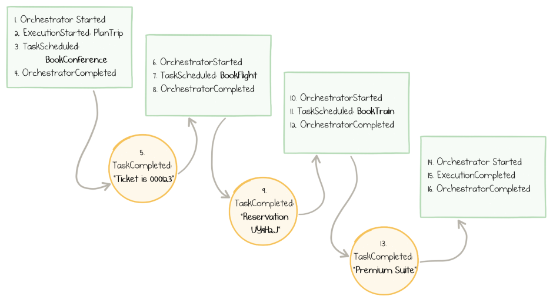

<center class="img-caption">Log of events in the course of orchestrator progression</center>

### Billing

Azure Functions on the serverless consumption-based plan are billed per execution + per duration of
execution.

The stop-replay behavior of durable orchestrators causes the single workflow "instance" to execute
the same orchestrator function multiple times. This also means paying for several short
executions.

However, the total bill usually ends up being much lower compared to the potential cost of blocking
synchronous calls to activities. The price of 5 executions of 100 ms each is significantly lower
than the cost of 1 execution of 30 seconds.

By the way, the first million executions per month are 
[at no charge](https://azure.microsoft.com/en-us/pricing/details/functions/),
so many scenarios incur no cost at all from Azure Functions service.

Another cost component to keep in mind is Azure Storage. Queues and Tables that are used behind the
scenes are charged to the end customer. In my experience, this charge remains close to zero for
low- to medium-load applications.

Beware of unintentional eternal loops or indefinite recursive fan-outs in your orchestrators. Those
can get expensive if you leave them out of control.

Error-handling and retries
--------------------------

What happens when an error occurs somewhere in the middle of the workflow? For instance, a third-party
flight booking service might not be able to process the request:

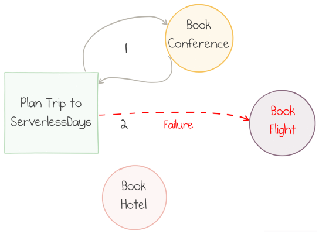

<center class="img-caption">One activity is unhealthy</center>

This situation is expected by Durable Functions. Instead of silently failing, the activity function
sends a message containing the information about the error back to the orchestrator.

The orchestrator deserializes the error details and, at the time of replay, throws a .NET exception
from the corresponding call. The developer is free to put a `try .. catch` block around the call
and handle the exception:

``` csharp
[FunctionName("SequentialWorkflow")]
public static async Task Sequential([OrchestrationTrigger] DurableOrchestrationContext context)
{
    var conf = await context.CallActivityAsync<ConfTicket>("BookConference", "ServerlessDays");
    try
    {
        var itinerary = MakeItinerary(/* ... */);
        await context.CallActivityAsync("BookFlight", itinerary);
    }
    catch (FunctionFailedException)
    {
        var alternativeItinerary = MakeAnotherItinerary(/* ... */);
        await context.CallActivityAsync("BookFlight", alternativeItinerary);
    }
    await context.CallActivityAsync("BookHotel", flight.Dates);
}
```

The code above falls back to a "backup plan" of booking another itinerary. Another typical pattern
would be to run a compensating activity to cancel the effects of any previous actions (un-book the
conference in our case) and leave the system in a clean state.

Quite often, the error might be transient, so it might make sense to retry the failed operation
after a pause. It's a such a common scenario that Durable Functions provides a dedicated API:

``` csharp
var options = new RetryOptions(
    firstRetryInterval: TimeSpan.FromMinutes(1),                    
    maxNumberOfAttempts: 5);
options.BackoffCoefficient = 2.0;

await context.CallActivityWithRetryAsync("BookFlight", options, itinerary);
```

The above code instructs the library to

- Retry up to 5 times
- Wait for 1 minute before the first retry
- Increase delays before every subsequent retry by the factor of 2 (1 min, 2 min, 4 min, etc.)

The significant point is that, once again, the orchestrator does not block while
awaiting retries. After a failed call, a message is scheduled for the moment in the future
to re-run the orchestrator and retry the call.

Sub-orchestrators
-----------------

Business processes may consist of numerous steps. To keep the code of orchestrators manageable,
Durable Functions allows nested orchestrators. A "parent" orchestrator can call out to child
orchestrators via the `context.CallSubOrchestratorAsync` method:

``` csharp
[FunctionName("CombinedOrchestrator")]
public static async Task CombinedOrchestrator([OrchestrationTrigger] DurableOrchestrationContext context)
{
    await context.CallSubOrchestratorAsync("BookTrip", serverlessDaysAmsterdam);
    await context.CallSubOrchestratorAsync("BookTrip", serverlessDaysHamburg);
}
```

The code above books two conferences, one after the other.

Fan-out / Fan-in
----------------

What if we want to run multiple activities in parallel?

For instance, in the example above, we could wish to book two conferences, but the
booking order might not matter. Still, when both bookings are completed, we want to combine the results
to produce an expense report for the finance department:

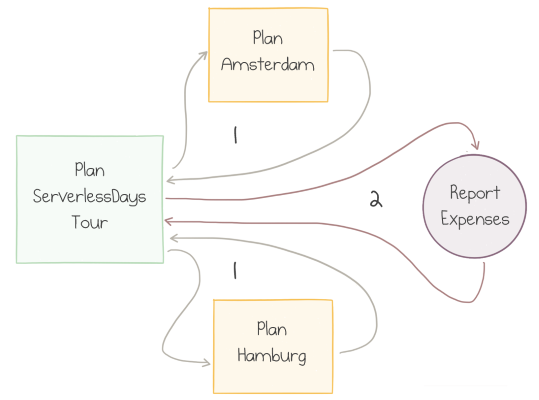

<center class="img-caption">Parallel calls followed by a final step</center>

In this scenario, the `BookTrip` orchestrator accepts an input parameter with the name of the 
conference and returns the expense information. `ReportExpenses` needs to receive both
expenses combined.

This goal can be easily achieved by scheduling two tasks (i.e., sending two messages) without
awaiting them separately. We use the familiar `Task.WhenAll` method to await both and combine
the results:

``` csharp
[FunctionName("ParallelWorkflow")]
public static async Task Parallel([OrchestrationTrigger] DurableOrchestrationContext context)
{
    var amsterdam = context.CallSubOrchestratorAsync("BookTrip", serverlessDaysAmsterdam);
    var hamburg   = context.CallSubOrchestratorAsync("BookTrip", serverlessDaysHamburg);

    var expenses = await Task.WhenAll(amsterdam, hamburg);

    await context.CallActivityAsync("ReportExpenses", expenses);
}
```

Remember that awaiting the `WhenAll` method doesn't synchronously block the orchestrator. It quits
the first time and then restarts two times on reply messages received from activities.
The first restart quits again, and only the second restart makes it past the `await`.

`Task.WhenAll` returns an array of results (one result per each input task), which is then
passed to the reporting activity.

Another example of parallelization could be a workflow sending e-mails to hundreds of
recipients. Such fan-out wouldn't be hard with normal queue-triggered functions: simply send
hundreds of messages. However, combining the results, if required for the next step
of the workflow, is quite challenging.

It's straightforward with a durable orchestrator:

``` csharp
var emailSendingTasks =
    recepients
    .Select(to => context.CallActivityAsync<bool>("SendEmail", to))
    .ToArray();

var results = await Task.WhenAll(emailSendingTasks);

if (results.All(r => r)) { /* ... */ }
```

Making hundreds of roundtrips to activities and back could cause numerous replays
of the orchestrator. As an optimization, if multiple activity functions complete around the same 
time, the orchestrator may internally process several messages as a batch and restart 
the orchestrator function only once per batch.

Other Concepts
--------------

There are many more patterns enabled by Durable Functions. Here is a quick list to give you some perspective:

- Waiting for the *first* completed task in a collection (rather than *all* of them) using the `Task.WhenAny`
method. Useful for scenarios like timeouts or competing actions.
- Pausing the workflow for a given period or until a deadline.
- Waiting for external events, e.g., bringing human interaction into the workflow.
- Running recurring workflows, when the flow repeats until a certain condition is met.

Further explanation and code samples are in 
[the docs](https://docs.microsoft.com/en-us/azure/azure-functions/durable/durable-functions-overview).

Conclusion
----------

I firmly believe that serverless applications utilizing a broad range of managed cloud services
are highly beneficial to many companies, due to both rapid development process and
the properly aligned billing model.

Serverless tech is still young; more high-level architectural patterns need to emerge
to enable expressive and composable implementations of large business systems.

Azure Durable Functions suggests some of the possible answers. It combines the clarity and readability
of sequential RPC-style code with the power and resilience of event-driven architecture.

[The documentation](https://docs.microsoft.com/en-us/azure/azure-functions/durable/durable-functions-overview)
for Durable Functions is excellent, with plenty of examples and how-to guides.
Learn it, try it for your real-life scenarios, and let me know your opinion&mdash;I'm
excited about the serverless future!

Acknowledgments
---------------

Many thanks to [Katy Shimizu](https://twitter.com/kashimizMSFT), [Chris Gillum](https://twitter.com/cgillum),
[Eric Fleming](https://twitter.com/efleming18), [KJ Jones](https://twitter.com/KevinJonesD),
[William Liebenberg](https://twitter.com/William_DotNet), [Andrea Tosato](https://twitter.com/ATosato86)
for reviewing the draft of this article and their valuable contributions and suggestions. The community 
around Azure Functions and Durable Functions is superb!
