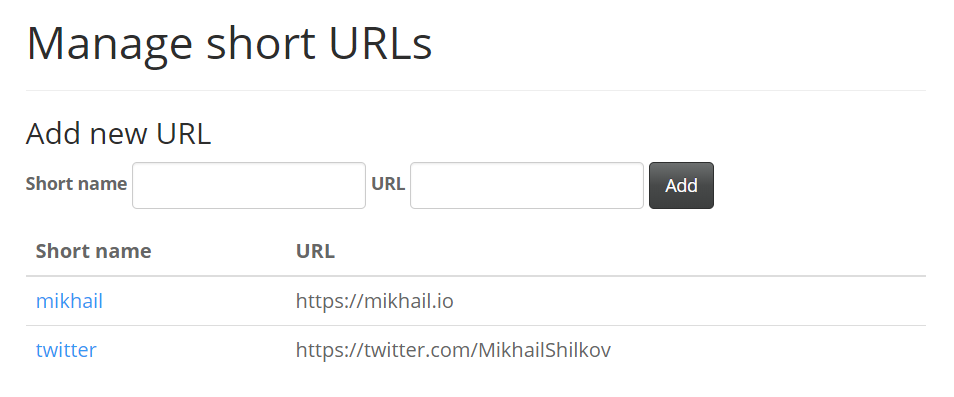
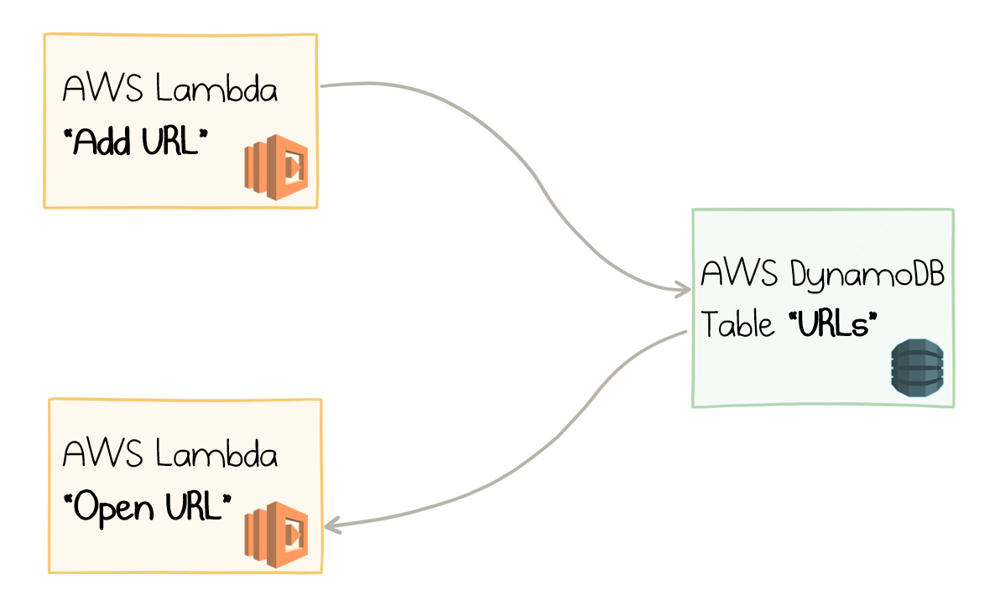
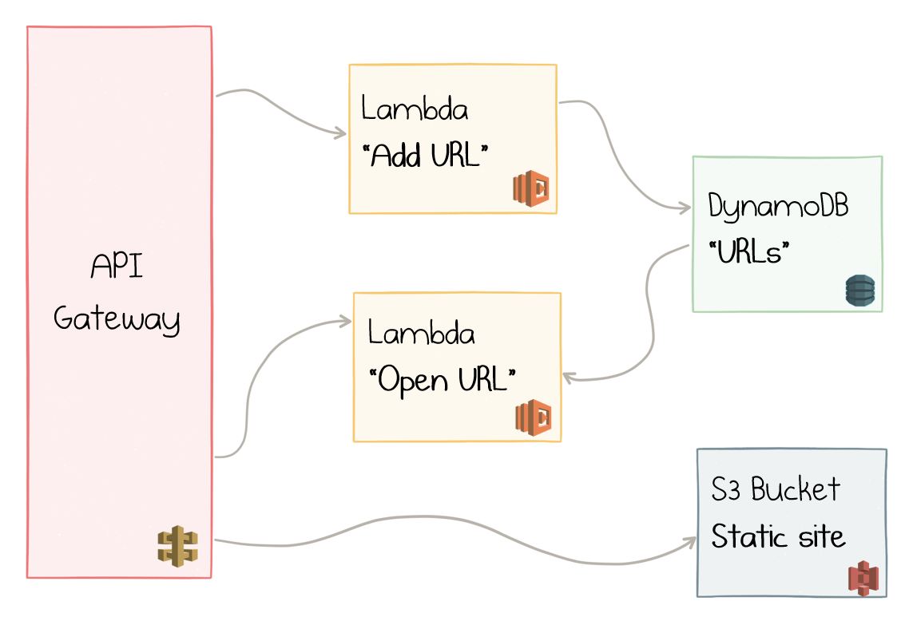
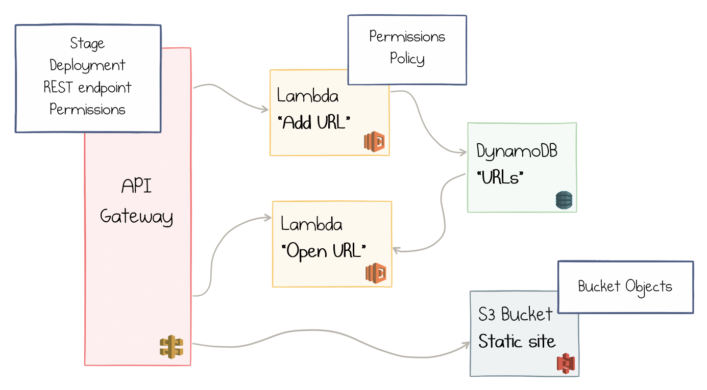
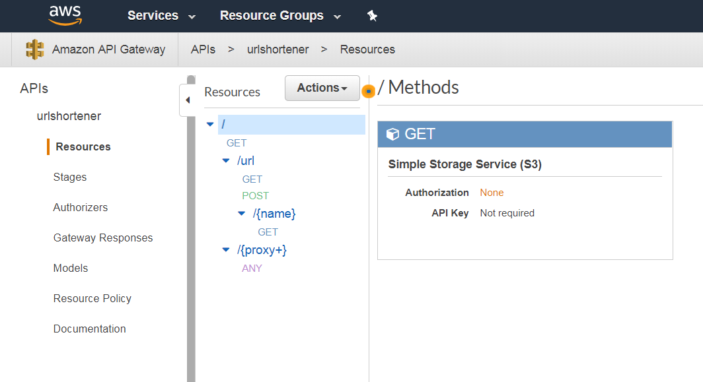
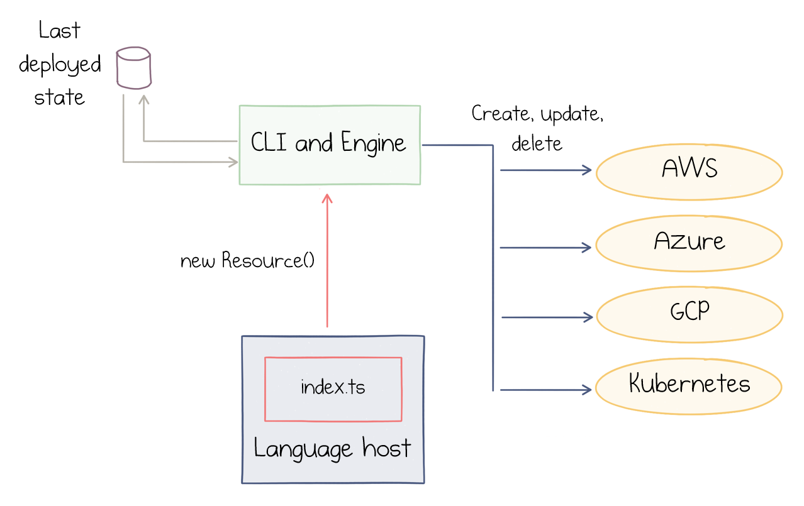
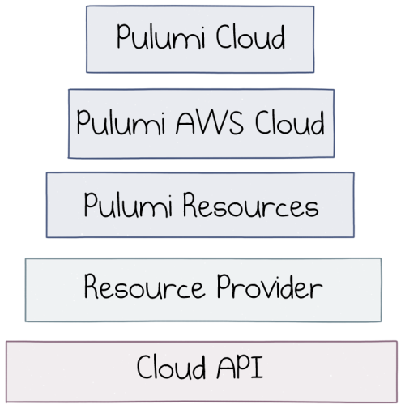

The rise of managed cloud services, cloud-native and serverless applications brings both new possibilities and challenges. More and more practices from software development process like version control, code review, continuous integration, and automated testing are applied to the cloud infrastructure automation.

Most existing tools suggest defining infrastructure in text-based markup formats, YAML being the favorite. In this article, I'm making a case for using real programming languages like TypeScript instead. Such a change makes even more software development practices applicable to the infrastructure realm.

Sample Application
------------------

It's easier to make a case given a specific example. For this essay, I define a URL Shortener application, a basic clone of tinyurl.com or bit.ly. There is an administrative page where one can define short aliases for long URLs:



<figcaption>URL Shortener sample app</figcaption>

Now, whenever a visitor goes to the base URL of the application + an existing alias, they get redirected to the full URL.

This app is simple to describe but involves enough moving parts to be representative of some real-world issues. As a bonus, there are many existing implementations on the web to compare with.

Serverless URL Shortener
------------------------

I'm a big proponent of the serverless architecture: the style of cloud applications being a combination of serverless functions and managed cloud services. They are fast to develop, effortless to run and cost pennies unless the application gets lots of users. However, even serverless applications have to deal with infrastructure, like databases, queues, and other sources of events and destinations of data.

My examples are going to use Amazon AWS, but this could be Microsoft Azure or Google Cloud Platform too.

So, the gist is to store URLs with short names as key-value pairs in Amazon DynamoDB and use AWS Lambdas to run the application code. Here is the initial sketch:



<figcaption>URL Shortener with AWS Lambda and DynamoDB</figcaption>

The Lambda at the top receives an event when somebody decides to add a new URL. It extracts the name and the URL from the request and saves them as an item in the DynamoDB table.

The Lambda at the bottom is called whenever a user navigates to a short URL. The code reads the full URL based on the requested path and returns a 301 response with the corresponding location.

Here is the implementation of the `Open URL` Lambda in JavaScript:

``` javascript
const aws = require('aws-sdk');
const table = new aws.DynamoDB.DocumentClient();

exports.handler = async (event) => {
  const name = event.path.substring(1);
  
  const params = { TableName: "urls", Key: { "name": name } };
  const value = await table.get(params).promise();
  
  const url = value && value.Item && value.Item.url;
  return url 
    ? { statusCode: 301, body: "", headers: { "Location": url } }
    : { statusCode: 404, body: name + " not found" };
};
```

That's 11 lines of code. I'll skip the implementation of `Add URL` function because it's very similar. Considering a third function to list the existing URLs for UI, we might end up with 30-40 lines of JavaScript in total.

So, how do we deploy the application?

Well, before we do that, we should realize that the above picture was an over-simplification:

- AWS Lambda can't handle HTTP requests directly, so we need to add AWS API Gateway in front of it.
- We also need to serve some static files for the UI, which we'll put into AWS S3 and proxy it with the same API Gateway.

Here is the updated diagram:



<figcaption>API Gateway, Lambda, DynamoDB, and S3</figcaption>

This is a viable design, but the details are even more complicated:

- API Gateway is a complex beast which needs Stages, Deployments, and REST Endpoints to be appropriately configured.
- Permissions and Policies need to be defined so that API Gateway could call Lambda and Lambda could access DynamoDB.
- Static Files should go to S3 Bucket Objects.

So, the actual setup involves a couple of dozen objects to be configured in AWS:



<figcaption>All cloud resources to be provisioned</figcaption>

How do we approach this task?

Options to Provision the Infrastructure
---------------------------------------

There are many options to provision a cloud application, each one has its trade-offs. Let's quickly go through the list of possibilities to understand the landscape.

AWS Web Console
---------------

AWS, like any other cloud, has a [web user interface](https://console.aws.amazon.com) to configure its resources:



<figcaption>AWS Web Console</figcaption>

That's a decent place to start&mdash;good for experimenting, figuring out the available options, following the tutorials, i.e., for exploration.

However, it doesn't suit particularly well for long-lived ever-changing applications developed in teams. A manually clicked deployment is pretty hard to reproduce in the exact manner, which becomes a maintainability issue pretty fast.

AWS Command Line Interface
--------------------------

The [AWS Command Line Interface](https://aws.amazon.com/cli/) (CLI) is a unified tool to manage all AWS services from a command prompt. You write the calls like

``` console
aws apigateway create-rest-api --name 'My First API' --description 'This is my first API'

aws apigateway create-stage --rest-api-id 1234123412 --stage-name 'dev' --description 'Development stage' --deployment-id a1b2c3
```

The initial experience might not be as smooth as clicking buttons in the browser, but the huge benefit is that you can *reuse* commands that you once wrote. You can build scripts by combining many commands into cohesive scenarios. So, your colleague can benefit from the same script that you created. You can provision multiple environments by parameterizing the scripts.

Frankly speaking, I've never done that for several reasons:

- CLI scripts feel too imperative to me. I have to describe "how" to do things, not "what" I want to get in the end.
- There seems to be no good story for updating existing resources. Do I write small delta scripts for each change? Do I have to keep them forever and run the full suite every time I need a new environment?
- If a failure occurs mid-way through the script, I need to manually repair everything to a consistent state. This gets messy real quick, and I have no desire to exercise this process, especially in production.

To overcome such limitations, the notion of the **Desired State Configuration** (DSC) was invented. Under this paradigm, one describes the desired layout of the infrastructure, and then the tooling takes care of either provisioning it from scratch or applying the required changes to an existing environment.

Which tool provides DSC model for AWS? There are legions.

AWS CloudFormation
------------------

[AWS CloudFormation](https://aws.amazon.com/cloudformation/) is the first-party tool for Desired State Configuration management from Amazon. CloudFormation templates use YAML to describe all the infrastructure resources of AWS.

Here is a snippet from [a private URL shortener example](https://aws.amazon.com/blogs/compute/build-a-serverless-private-url-shortener/) kindly provided at AWS blog:

``` yaml
Resources:
  S3BucketForURLs:
    Type: "AWS::S3::Bucket"
    DeletionPolicy: Delete
    Properties:
      BucketName: !If [ "CreateNewBucket", !Ref "AWS::NoValue", !Ref S3BucketName ]
      WebsiteConfiguration:
        IndexDocument: "index.html"
      LifecycleConfiguration:
        Rules:
          -
            Id: DisposeShortUrls
            ExpirationInDays: !Ref URLExpiration
            Prefix: "u"
            Status: Enabled
```

This is just a very short fragment: the complete example consists of 317 lines YAML. That's an order of magnitude more than the actual JavaScript code that we have in the application!

CloudFormation is a powerful tool, but it demands quite some learning to be done to master it. Moreover, it's specific to AWS: you won't be able to transfer the skill to other cloud providers.

Wouldn't it be great if there was a universal DSC format? Meet Terraform.

Terraform
---------

[HashiCorp Terraform](https://www.terraform.io/) is an open source tool to define infrastructure in declarative configuration files. It has a pluggable architecture, so the tool supports all major clouds and even hybrid scenarios.

The custom text-based Terraform `.tf` format is used to define the configurations. The templating language is quite powerful, and once you learn it, you can use it for different cloud providers.

Here is a snippet from [AWS Lambda Short URL Generator](https://github.com/jamesridgway/aws-lambda-short-url) example:

``` tf
resource "aws_api_gateway_rest_api" "short_urls_api_gateway" {
  name        = "Short URLs API"
  description = "API for managing short URLs."
}
resource "aws_api_gateway_usage_plan" "short_urls_admin_api_key_usage_plan" {
  name         = "Short URLs admin API key usage plan"
  description  = "Usage plan for the admin API key for Short URLS."
  api_stages {
    api_id = "${aws_api_gateway_rest_api.short_urls_api_gateway.id}"
    stage  = "${aws_api_gateway_deployment.short_url_api_deployment.stage_name}"
  }
}
```

This time, the complete example is around 450 lines of textual templates. Are there ways to reduce the size of the infrastructure definition?

Yes, by raising the level of abstraction. It's possible with Terraform's modules, or by using other, more specialized tools.

Serverless Framework and SAM
----------------------------

[The Serverless Framework](https://serverless.com/) is an infrastructure management tool focused on serverless applications. It works across cloud providers (AWS support is the strongest though) and only exposes features related to building applications with cloud functions.

The benefit is that it's much more concise. Once again, the tool is using YAML to define the templates, here is the snippet from [Serverless URL Shortener](https://github.com/danielireson/serverless-url-shortener) example:

``` yaml
functions:
  store:
    handler: api/store.handle
    events:
      - http:
          path: /
          method: post
          cors: true
```

The domain-specific language yields a shorter definition: this example has 45 lines of YAML + 123 lines of JavaScript functions.

However, the conciseness has a flip side: as soon as you veer outside of the fairly "thin" golden path&mdash;the cloud functions and an incomplete list of event sources&mdash;you have to fall back to more generic tools like CloudFormation. As soon as your landscape includes lower-level infrastructure work or some container-based components, you're stuck using multiple config languages and tools again.

Amazon's [AWS Serverless Application Model](https://docs.aws.amazon.com/serverless-application-model/index.html) (SAM) looks very similar to the Serverless Framework but tailored to be AWS-specific.

Is that the end game? I don't think so.

Desired Properties of Infrastructure Definition Tool
----------------------------------------------------

So what have we learned while going through the existing landscape? The perfect infrastructure tools should:

- Provide **reproducible** results of deployments
- Be **scriptable**, i.e., require no human intervention after the definition is complete
- Define the **desired state** rather than exact steps to achieve it
- Support **multiple cloud providers** and hybrid scenarios
- Be **universal** in the sense of using the same tool to define any type of resource
- Be **succinct** and **concise** to stay readable and manageable
- ~~Use YAML-based format~~

Nah, I crossed out the last item. YAML seems to be the most popular language among this class of tools (and I haven't even touched Kubernetes yet!), but I'm not convinced it works well for me. [YAML has many flaws, and I just don't want to use it](https://noyaml.com/).

Have you noticed that I haven't mentioned **Infrastructure as code** a single time yet? Well, here we go (from [Wikipedia](https://en.wikipedia.org/wiki/Infrastructure_as_code)):

> Infrastructure as code (IaC) is the process of managing and provisioning computer data centers through machine-readable definition files, rather than physical hardware configuration or interactive configuration tools.

Shouldn't it be called "Infrastructure as definition files", or "Infrastructure as YAML"?

As a software developer, what I really want is "Infrastructure as actual code, you know, the program thing". I want to use **the same language** that I already know. I want to stay in the same editor. I want to get IntelliSense **auto-completion** when I type. I want to see the **compilation errors** when what I typed is not syntactically correct. I want to reuse the **developer skills** that I already have. I want to come up with **abstractions** to generalize my code and create **reusable components**. I want to **leverage the open-source community** who would create much better components than I ever could. I want to **combine the code and infrastructure** in one code project.

If you are with me on that, keep reading. You get all of that with Pulumi.

Pulumi
------

[Pulumi](https://pulumi.io/) is a tool to build cloud-based software using real programming languages. They support all major cloud providers, plus Kubernetes.

Pulumi programming model supports Go and Python too, but I'm going to use TypeScript for the rest of the article.

While prototyping a URL shortener, I explain the fundamental way of working and illustrate the benefits and some trade-offs. If you want to follow along, [install Pulumi](https://pulumi.io/quickstart/install.html).

How Pulumi Works
----------------

Let's start defining our URL shortener application in TypeScript. I installed `@pulumi/pulumi` and `@pulumi/aws` NPM modules so that I can start the program. The first resource to create is a DynamoDB table:

``` typescript
    import * as aws from "@pulumi/aws";

    // A DynamoDB table with a single primary key
    let counterTable = new aws.dynamodb.Table("urls", {
        name: "urls",
        attributes: [
            { name: "name", type: "S" },
        ],
        hashKey: "name",
        readCapacity: 1,
        writeCapacity: 1
    });
```

I use `pulumi` CLI to run this program to provision the actual resource in AWS:

``` console
> pulumi up

Previewing update (urlshortener):

     Type                   Name             Plan
 +   pulumi:pulumi:Stack    urlshortener     create
 +    aws:dynamodb:Table    urls             create

Resources:
    + 2 to create

Do you want to perform this update? yes
Updating (urlshortener):

     Type                   Name             Status
 +   pulumi:pulumi:Stack    urlshortener     created
 +    aws:dynamodb:Table    urls             created

Resources:
    + 2 created
```

The CLI first shows the preview of the changes to be made, and when I confirm, it creates the resource. It also creates a **stack**&mdash;a container for all the resources of the application.

This code might look like an imperative command to create a DynamoDB table, but it actually isn't. If I go ahead and change `readCapacity` to `2` and then re-run `pulumi up`, it produces a different outcome:

``` console
> pulumi up

Previewing update (urlshortener):

     Type                   Name             Plan
     pulumi:pulumi:Stack    urlshortener        
 ~   aws:dynamodb:Table     urls             update  [diff: ~readCapacity]

Resources:
    ~ 1 to update
    1 unchanged
```

It detects the exact change that I made and suggests an update. The following picture illustrates how Pulumi works:



<figcaption>How Pulumi works</figcaption>

`index.ts` in the red square is my program. Pulumi's language host understands TypeScript and translates the code to commands to the internal engine. As a result, the engine builds a tree of resources-to-be-provisioned, the desired state of the infrastructure.

The end state of the last deployment is persisted in the storage (can be in pulumi.com backend or a file on disk). The engine then compares the current state of the system with the desired state of the program and calculates the delta in terms of create-update-delete commands to the cloud provider.

Help Of Types
-------------

Now I can proceed to the code that defines a Lambda function:

``` typescript
// Create a Role giving our Lambda access.
let policy: aws.iam.PolicyDocument = { /* Redacted for brevity */ };
let role = new aws.iam.Role("lambda-role", {
    assumeRolePolicy: JSON.stringify(policy),
});
let fullAccess = new aws.iam.RolePolicyAttachment("lambda-access", {
    role: role,
    policyArn: aws.iam.AWSLambdaFullAccess,
});

// Create a Lambda function, using code from the `./app` folder.
let lambda = new aws.lambda.Function("lambda-get", {
    runtime: aws.lambda.NodeJS8d10Runtime,
    code: new pulumi.asset.AssetArchive({
        ".": new pulumi.asset.FileArchive("./app"),
    }),
    timeout: 300,
    handler: "read.handler",
    role: role.arn,
    environment: { 
        variables: {
            "COUNTER_TABLE": counterTable.name
        }
    },
}, { dependsOn: [fullAccess] });
```

You can see that the complexity kicked in and the code size is growing. However, now I start to gain real benefits from using a typed programming language:

- I'm using objects in the definitions of other object's parameters. If I misspell their name, I don't get a runtime failure but an immediate error message from the editor.
- If I don't know which options I need to provide, I can go to the type definition and look it up (or use IntelliSense).
- If I forget to specify a mandatory option, I get a clear error.
- If the type of the input parameter doesn't match the type of the object I'm passing, I get an error again.
- I can use language features like `JSON.stringify` right inside my program. In fact, I can reference and use any NPM module.

You can see the code for API Gateway [here](https://github.com/mikhailshilkov/fosdem2019/blob/master/samples/1-raw/index.ts#L60-L118). It looks too verbose, doesn't it? Moreover, I'm only half-way through with only one Lambda function defined.

Reusable Components
-------------------

We can do better than that. Here is the improved definition of the same Lambda function:

``` typescript
import { Lambda } from "./lambda";

const func = new Lambda("lambda-get", {
    path: "./app",
    file: "read",
    environment: { 
       "COUNTER_TABLE": counterTable.name
    },
});
```

Now, isn't that beautiful? Only the essential options remained, while all the machinery is gone. Well, it's not completely gone, it's been hidden behind an *abstraction*.

I defined a **custom component** called `Lambda`:

``` typescript
export interface LambdaOptions {
    readonly path: string;
    readonly file: string;
    
    readonly environment?:  pulumi.Input<{
        [key: string]: pulumi.Input<string>;
    }>;    
}

export class Lambda extends pulumi.ComponentResource {
    public readonly lambda: aws.lambda.Function;

    constructor(name: string,
        options: LambdaOptions,
        opts?: pulumi.ResourceOptions) {
        
        super("my:Lambda", name, opts);

        const role = //... Role as defined in the last snippet
        const fullAccess = //... RolePolicyAttachment as defined in the last snippet
        
        this.lambda = new aws.lambda.Function(`${name}-func`, {
            runtime: aws.lambda.NodeJS8d10Runtime,
            code: new pulumi.asset.AssetArchive({
                ".": new pulumi.asset.FileArchive(options.path),
            }),
            timeout: 300,
            handler: `${options.file}.handler`,
            role: role.arn,
            environment: {
                variables: options.environment
            }
        }, { dependsOn: [fullAccess], parent: this });
    }
}
```

The interface `LambdaOptions` defines options that are important for my abstraction. The class `Lambda` derives from `pulumi.ComponentResource` and creates all the child resources in its constructor. 

A nice effect is that one can see the structure in `pulumi` preview:

``` console
Previewing update (urlshortener):

     Type                                Name                  Plan
 +   pulumi:pulumi:Stack                 urlshortener          create
 +     my:Lambda                         lambda-get            create
 +       aws:iam:Role                    lambda-get-role       create
 +       aws:iam:RolePolicyAttachment    lambda-get-access     create
 +       aws:lambda:Function             lambda-get-func       create
 +     aws:dynamodb:Table                urls                  create
```

The `Endpoint` component simplifies the definition of API Gateway (see [the source](https://github.com/mikhailshilkov/fosdem2019/blob/master/samples/2-components/endpoint.ts)):

``` typescript
const api = new Endpoint("urlapi", {
    path: "/{proxy+}",
    lambda: func.lambda
});
```

The component hides the complexity from the clients&mdash;if the abstraction was selected correctly, that is. The component class can be reused in multiple places, in several projects, across teams, etc.

Standard Component Library
--------------------------

In fact, Pulumi team came up with lots of high-level components that build abstractions on top of raw resources. The components from the `@pulumi/cloud-aws` package are particularly useful for serverless applications.

Here is the full URL shortener application with DynamoDB table, Lambdas, API Gateway, and S3-based static files:

``` typescript
import * as aws from "@pulumi/cloud-aws";

// Create a table `urls`, with `name` as primary key.
let urlTable = new aws.Table("urls", "name");

// Create a web server.
let endpoint = new aws.API("urlshortener");

// Serve all files in the www directory to the root.
endpoint.static("/", "www");

// GET /url/{name} redirects to the target URL based on a short-name.
endpoint.get("/url/{name}", async (req, res) => {
    let name = req.params["name"];
    let value = await urlTable.get({name});
    let url = value && value.url;

    // If we found an entry, 301 redirect to it; else, 404.
    if (url) {
        res.setHeader("Location", url);
        res.status(301);
        res.end("");
    }
    else {
        res.status(404);
        res.end("");
    }
});

// POST /url registers a new URL with a given short-name.
endpoint.post("/url", async (req, res) => {
    let url = req.query["url"];
    let name = req.query["name"];
    await urlTable.insert({ name, url });
    res.json({ shortenedURLName: name });
});

export let endpointUrl = endpoint.publish().url;
```

The coolest thing here is that the actual *implementation code* of AWS Lambdas is [intertwined](https://blog.pulumi.com/lambdas-as-lambdas-the-magic-of-simple-serverless-functions) with the *definition of resources*. The code looks very similar to an Express application. AWS Lambdas are defined as TypeScript lambdas. All strongly typed and compile-time checked.

It's worth noting that at the moment such high-level components only exist in TypeScript. One could create their custom components in Python or Go, but there is no standard library available. Pulumi folks [are actively trying to figure out a way to bridge this gap](https://github.com/pulumi/pulumi/issues/2430).

Avoiding Vendor Lock-in?
------------------------

If you look closely at the previous code block, you notice that only one line is AWS-specific: the `import` statement. The rest is just naming. 

We can get rid of that one too: just change the import to `import * as cloud from "@pulumi/cloud";` and replace `aws.` with `cloud.` everywhere. Now, we'd have to go to the stack configuration file and specify the cloud provider there:

``` yaml
config:
  cloud:provider: aws
```

Which is enough to make the application work again!

Vendor lock-in seems to be a big concern among many people when it comes to cloud architectures heavily relying on managed cloud services, including serverless applications. While I don't necessarily share those concerns and am not sure if generic abstractions are the right way to go, Pulumi Cloud library can be one direction for the exploration.

The following picture illustrates the choice of the level of abstraction that Pulumi provides:



<figcaption>Pulumi abstraction layers</figcaption>

Working on top of the cloud provider's API and internal resource provider, you can choose to work with raw components with maximum flexibility, or opt-in for higher-level abstractions. Mix-and-match in the same program is possible too.

Infrastructure as Real Code
---------------------------

Designing applications for the modern cloud means utilizing multiple cloud services which have to be configured to play nicely together. The Infrastructure as Code approach is almost a requirement to keep the management of such applications reliable in a team setting and over the extended period.

Application code and supporting infrastructure become more and more blended, so it's natural that software developers take the responsibility to define both. The next logical step is to use the same set of languages, tooling, and practices for both software and infrastructure.

Pulumi exposes cloud resources as APIs in several popular general-purpose programming languages. Developers can directly transfer their skills and experience to define, build, compose, and deploy modern cloud-native and serverless applications more efficiently than ever.