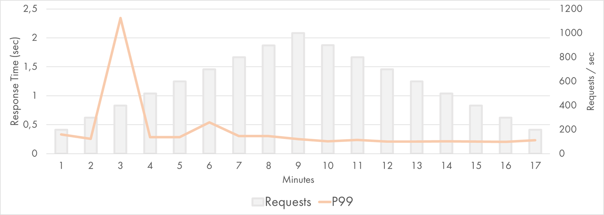
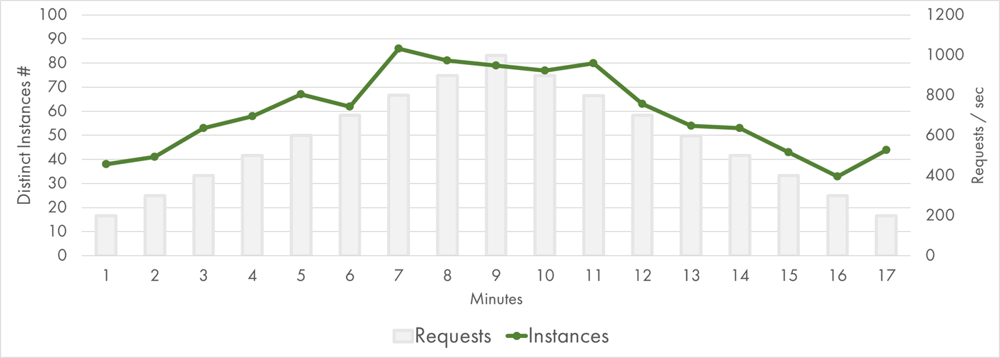
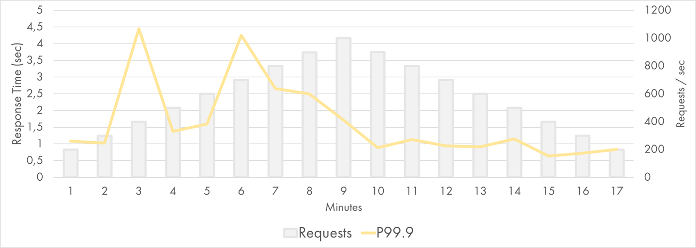
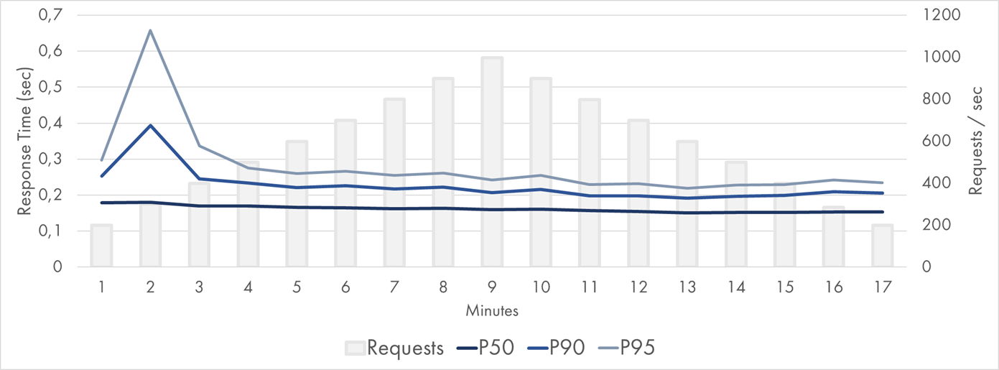
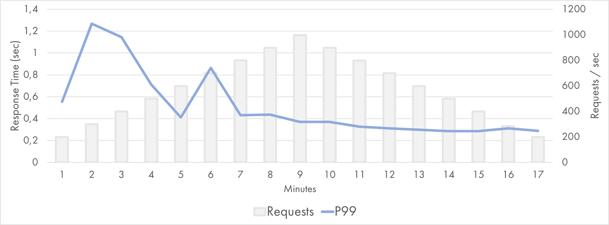
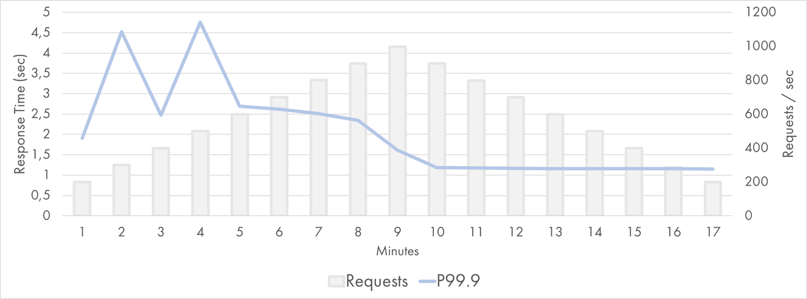
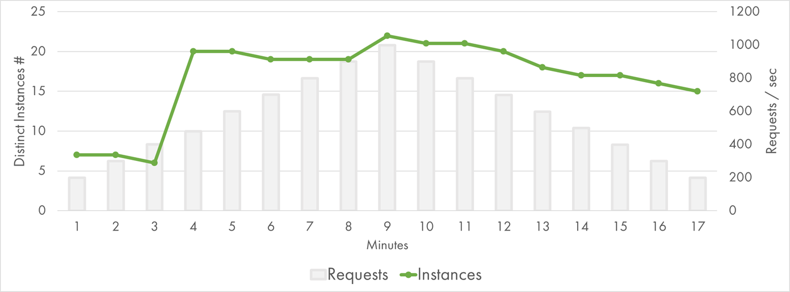

Serverless compute is a very productive and quick way to get an application up and running. A developer writes a piece of code that solves a particular task and uploads it to the cloud. The provider handles code deployment and the ops burden of managing all the required infrastructure, so that the Function is always available, secure and performant.

Performance is a feature, and the ability to run the same application for 10 users or 10 million users is very appealing. Unfortunately, FaaS is not magical, so scalability limits do exist. That's why I spend time testing the existing FaaS services to highlight the cases where performance might not be perfect. For some background, you can read my previous articles:  [From 0 to 1000 Instances: How Serverless Providers Scale Queue Processing](https://mikhail.io/2018/11/from-0-to-1000-instances-how-serverless-providers-scale-queue-processing/) for queue-based workloads and [Serverless: Cold Start War](https://mikhail.io/2018/08/serverless-cold-start-war/) for exploring cold start latencies.

Today, I want to dig into the scalability of serverless HTTP-based functions. HTTP-based functions are a popular use case that most developers can relate to, and they are also heavily impacted by the ability to scale. When your app goes viral on social networks, scores the Hacker News front page, or gets featured on TV, the last thing you want is slow responses and timeouts.

I implemented a simple HTTP-triggered function and deployed it across the Big-3 cloud providers&mdash;Amazon, Microsoft, and Google. Next, I ran a load test issuing hundreds of requests per second to each function. In this article, I present the design and the results of these experiments.

*DISCLAIMER: Performance testing is hard. I might be missing some crucial factors and parameters that influence the outcome. My interpretation might be wrong. The results might change over time. If you happen to know a way to improve my tests, please let me know, and I will re-run them and re-publish the results.*

StackOverflow on FaaS
---------------------

Every developer knows [StackOverflow](https://stackoverflow.com/) and uses it pretty much every day. I've made the goal to serve traffic comparable to what StackOverflow sees, solely from a serverless function.

StackOverflow is an excellent target for many reasons:

- Publish the actual request statistics from the site (see [the data from 2016](https://nickcraver.com/blog/2016/02/17/stack-overflow-the-architecture-2016-edition/))
- Very transparent about their tech stack (same link above)
- Publish  [the full database](https://www.brentozar.com/archive/2015/10/how-to-download-the-stack-overflow-database-via-bittorrent/) and provide [a tool to query the data online](https://data.stackexchange.com/stackoverflow/queries)

StackOverflow runs on .NET Core, SQL Server, Redis, Elastic, etc. Obviously, my goal is not to replicate the whole site. I just want to serve the comparable traffic to the outside world.

Here are some important metrics for my experiment:

- StackOverflow served 66 million pages per day, which is 760 pages/sec on average.
- We’ll make the assumption that the vast majority of those pageviews are question pages, so I will ignore everything else.
- We know they serve the whole page as one server-rendered HTML, so we’ll do something comparable.
- Each page should be ~ 100kb size before compression.

With this in mind, I came up with the following experiment design:

- Create a HTML template for the whole question page with question and answer markup replaced by placeholders.
- Download the data of about 1000 questions and their respective answers from the [the data explorer](https://data.stackexchange.com/stackoverflow/query/new).
- Save the HTML templates and JSON data in blob storage of each cloud provider.
- Implement a serverless function that retrieves the question data, populates the template, and returns the HTML in response.

<figcaption>Serving StackOverflow Traffic from a Serverless Function</figcaption>

The HTML template is loaded at the first request and then cached in memory. The question/answers data file is loaded from the blob storage for every request. Template population is accomplished with string concatenation.

In my view, this setup is a simple but fair approximation of StackOverflow’s front-end. In addition, it is somewhat representative of many real-world web applications.

Metrics Setup
-------------

I analyzed the scalability of the following cloud services:

- AWS Lambda triggered via Amazon API Gateway ([docs](https://docs.aws.amazon.com/en_us/lambda/latest/dg/with-on-demand-https.html))
- Azure Function with an HTTP trigger ([docs](https://docs.microsoft.com/en-us/azure/azure-functions/functions-bindings-http-webhook))
- Google Cloud HTTP Function ([docs](https://cloud.google.com/functions/docs/writing/http))

All functions were implemented in JavaScript (Node.js) and were running on the latest GA runtime.

Since built-in monitoring tools, such as CloudWatch, would only report the function execution duration, which does not include other potential delays in the HTTP pipeline, I instead measured end-to-end latency from the client perspective. This means that the latency of the network and HTTP gateway (e.g., API Gateway in the case of AWS) were included in the total duration.

Requests were sent from multiple VMs outside the target cloud provider's region but in geographical proximity. Network latency was present in the metrics, but I estimated it to be 20-30 milliseconds at most.

<figcaption>Measuring Response Time of a Serverless Function</figcaption>

Blob storage services of all cloud providers have enough throughput to serve one blob per HTTP request. However, the latencies differ among the clouds, so I included blob fetch duration measurements in the performance baseline.

Each measurement was then saved to persistent storage and analyzed afterward.

The charts below show [percentile](https://en.wikipedia.org/wiki/Percentile) values. For instance, the 95th percentile (written as P95) value of 100ms means that 95% of the requests were faster than 100ms while 5% were slower than that. P50 is the median.

Load Pattern
------------

I wanted to test the ability of serverless functions to scale up rapidly in response to the growth in request rate, so I came up with a dynamic load scenario.

The experiments started with a baseline 10% of the target load. The goal of the baseline was to make sure that the app was overall healthy, to evaluate the basic latency and the impact of blob storage on it.

At some point (around minute 0 of the charts), the load began to grow and reached 1000 RPS within 8 minutes. After the peak, the cooldown period started, and the load steadily decreased to zero in 8 more minutes.

<figcaption>Request Distribution during the Load Test</figcaption>

Even though the growth period on the left and the decline period on the right represented the same number of requests, the hypothesis was that the first half might be more challenging because of the need to provision new resources rapidly.

In total, 600,000 requests were served within 17 minutes with the total outbound traffic of 70 GB.

Finally, we’ve made it through all the mechanics, and now it's time to present the actual results.

AWS Lambda
----------

AWS Lambda was our first target for the experiment. I provisioned 512 MB size for Lambda instances, which is a medium-range value. I expected larger instances to be slightly faster, and smaller instances to be a bit slower, but the load is not very demanding to CPU, so the overall results should be comparable across the spectrum.

During the low-load baseline, the median response time was about 70 ms with a minimum of 50 ms. The median response time from the S3 bucket was 50 ms.

Here is the P50-P95 latency chart during the load test:

<figcaption>AWS Lambda Response Time Distribution (P50-P95)</figcaption>

The percentiles were very consistent and flat. The median response time was still around 70 ms with no variance observed. P90 and P95 were quite stable too.

Only the 99th percentile displayed the difference between the ramp-up period on the left and the cooldown period on the right:

<figcaption>AWS Lambda Response Time Distribution (P99)</figcaption>

AWS Lambda scales by creating multiple instances of the same function that handle the requests in parallel. Each Lambda instance is handling a single request at any given time, which is why the scale is measured in "concurrent executions." When the current request is done being processed, the same instance can be reused for a subsequent request.

Instance identifier can be retrieved from `/proc/self/cgroup` of a lambda, so I recorded this value for each execution. The following chart shows the number of instances throughout the experiment:

<figcaption>AWS Lambda Concurrent Executions</figcaption

There were about 80 concurrent executions at peak. That's quite a few, but still, almost an order of magnitude fewer instances compared to [my queue processing experiment](https://mikhail.io/2018/11/from-0-to-1000-instances-how-serverless-providers-scale-queue-processing/#crunching-numbers). It felt that AWS was capable of scaling even further.

P99.9 showed slowness of the least lucky 0.1% requests. Most probably, it had lots of cold starts in it:

<figcaption>AWS Lambda Response Time Distribution (P99.9)</figcaption

Still, even those requests were mostly served within 2-3 seconds.

Google Cloud Functions
----------------------

Now, let's look at the results of Google Cloud Functions. Once again I provisioned 512 MB instance size (same as for Lambda).

During the low-load baseline, the median response time was about 150 ms with a minimum of 100 ms. Almost all of that time was spent fetching blobs from Cloud Storage: Its median latency was over 130 ms! I haven't spent too much time investigating the reason, but I assume that Google Cloud Storage has higher latency for small files than S3. Zach Bjornson published  [the comparison of storage latencies](http://blog.zachbjornson.com/2015/12/29/cloud-storage-performance.html). Although it's 3 years old, the conclusion was that "GCS averaged more than three times higher latency" when compared to Azure and AWS.

That's an important observation because the Function execution times were twice as big as those recorded on AWS. Keeping this difference in mind, here is the P50-P95 latency chart during the GCP load test:

<figcaption>Google Cloud Function Response Time Distribution (P50-P95)</figcaption

The median value was stable and flat at 150-180 ms. P90 and P95 had some spikes during the first 3 minutes. Google passed the test, but the lower percentiles were not perfect.

The 99th percentile was relatively solid though. It was higher on the left, but it stayed within 1 second most of the time:

<figcaption>Google Cloud Function Response Time Distribution (P99)</figcaption

The scaling model of Google Functions appeared to be very similar to the one of AWS Lambda. This means that 2x duration of the average execution required 2x more concurrent executions to run and 2x more instances to be provisioned:

<figcaption>Google Cloud Function Concurrent Executions</figcaption

Indeed, there were about 160 concurrent executions at peak. GCP had to work twice as hard because of the storage latency, which might explain some of the additional variations of response time.

Besides, Google seems to manage instance lifecycle differently. It provisioned a larger batch of instances during the first two minutes, which was in line with [my previous findings](https://mikhail.io/2018/11/from-0-to-1000-instances-how-serverless-providers-scale-queue-processing/#pause-the-world-workload). It also kept instances for longer when the traffic went down (or at least, reused the existing instances more evenly).

For completeness, here are the P99.9 values:

<figcaption>Google Cloud Function Response Time Distribution (P99.9)</figcaption

They fluctuated between 1 and 5 seconds on the left and were incredibly stable on the right.

Azure
-----

Experiments with Azure Functions were run on [Consumption Plan](https://docs.microsoft.com/en-us/azure/azure-functions/functions-scale#consumption-plan)
&mdash;the dynamically scaled and billed-per-execution runtime. Consumption Plan doesn't have a configuration for allocated memory or any other instance size parameters.

During the low-load baseline, the median response time was about 95 ms with a minimum of 45 ms, which is close to AWS and considerably faster than GCP. This time, JSON file retrieval was not the main contributor to the end-to-end latency: The median response time of Azure Blob Storage was an amazing 8 ms.

However, it turns out that the scaling model of Azure Functions doesn't work well for my experiment. Very high latencies were observed during the load test on Azure:

<figcaption>Azure Function (Node.js) Response Time Distribution (P50-P95)</figcaption

The concurrency model of Azure Functions is different from the counterparts of AWS/GCP. Function App instance is closer to a VM than a single-task container. It runs multiple concurrent executions in parallel. A central coordinator called Scale Controller monitors the metrics from existing instances and determines how many instances to provision on top. Instance identifier can be retrieved from environment variables of a function, so I recorded this value for each execution.

The multiple-requests-at-one-instance model didn't help in terms of the total instances required to process the traffic:

<figcaption>Azure Function (Node.js) Instances</figcaption

At peak, 90 instances were required, which is almost the same as the number of current executions of AWS Lambda. Given the I/O bound nature of my function, this was surprising to me.

Puzzled by the moderate results, I decided to run the same application as a .NET Azure Function and compare the performance. The same function ported to C# got much faster:

<figcaption>Azure Function (.NET) Response Time Distribution (P50-P95)</figcaption

P50 was extremely good: It stayed below 50 ms (leveraging the blazingly fast Blob Storage) for the whole period except for one point when it was 140 ms. P90 and P95 were stable except for three data points.

The chart of instance growth was very different from the JavaScript one too:

<figcaption>Azure Function (.NET) Instances</figcaption

Basically, it spiked to 20 instances at the third minute, and that was enough for the rest of the test. I concluded that the .NET worker was more efficient compared to Node.js worker, at least for my scenario.

If I compare the percentile charts with the instance charts, it looks as if the latency spikes happen at the time when new instances get provisioned. For some reason, the performance suffers during the scale out. It's not just cold starts at the new instances: P90 and even P50 are affected. It might be a good topic for a separate investigation.

Conclusion
----------

During the experiment, sample StackOverflow pages were built and served from AWS Lambda, Google Cloud Functions, and Azure Functions at the rate of up to 1000 pageviews per second. Each Function call served a single pageview and was a combination of I/O workload (reading blob storage) and CPU usage (for parsing JSON and rendering HTML).

All cloud providers were able to scale up and serve the traffic. However, the latency distributions were quite different.

AWS Lambda was solid: Median response time was always below 100 ms, 95th percentile was below 200 ms, and 99th percentile exceeded 500 ms just once.

Google Cloud Storage seemed to have the highest latency out of the three cloud providers. Google Cloud Functions had a bit of a slowdown during the first two minutes of the scale-out but otherwise were quite stable and responsive.

Azure Functions had difficulties during the scale-out period and the response time went up to several seconds. .NET worker appeared to be more performant compared to Node.js one, but both of them show undesirable spikes when new instances are provisioned.

Here is my practical advice to take home:

- Function-as-a-Service is a great model to build applications that can work for low-usage scenarios, high-load applications, and even spiky workloads.
- Scalability limits do exist, so if you anticipate high growth in the application's usage, run a simple load test to see how it behaves.
- Always test in combination with your non-serverless dependencies. I've selected scalable-by-definition cloud blob storage, and yet I got some influence of its behavior on the results. If you use a database or a third-party service, it's quite likely they will hit the scalability limit much earlier than the serverless compute.